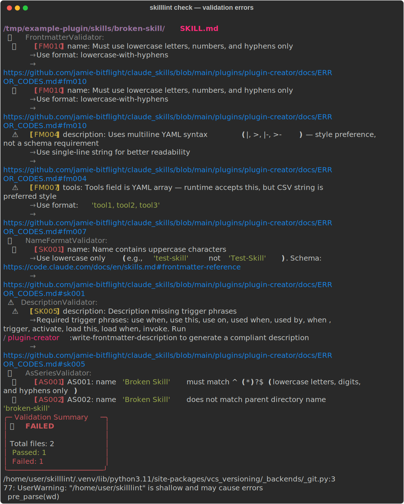
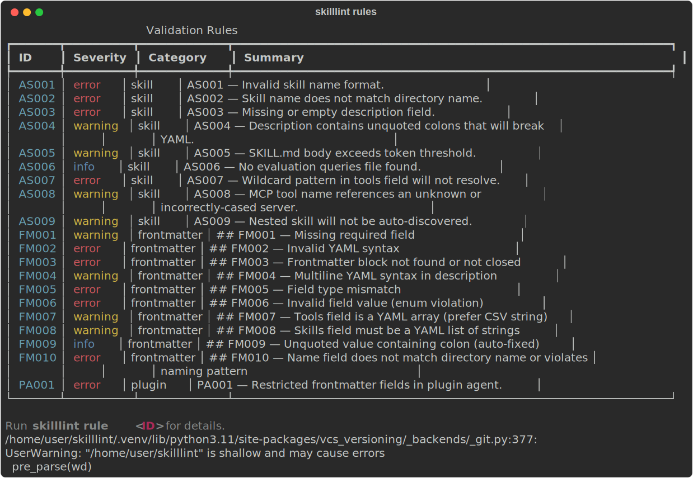
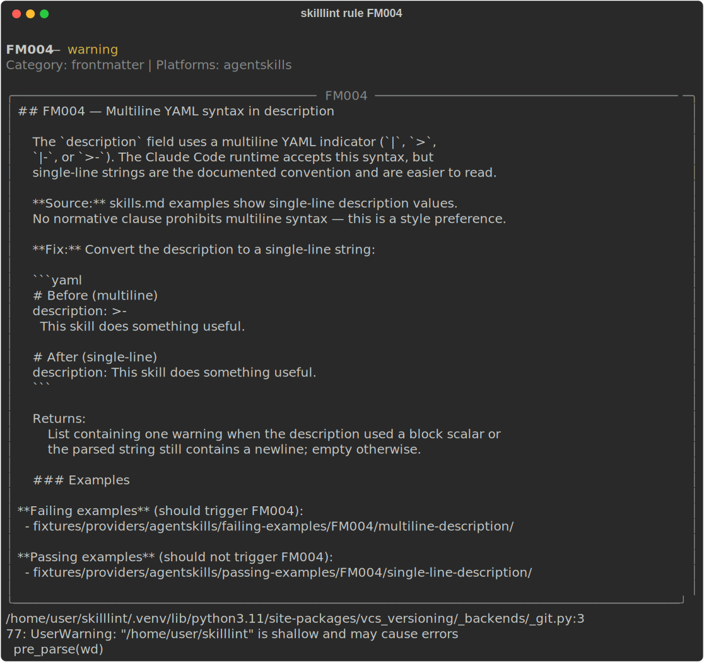

# skilllint

[](https://pypi.org/project/skilllint/)
[](https://pypi.org/project/skilllint/)
[](https://github.com/bitflight-devops/skilllint/blob/main/LICENSE)
[](https://github.com/bitflight-devops/skilllint/actions/workflows/test.yml)

Static analysis linter for AI agent plugins, skills, and agents — for Claude Code, Cursor, Codex, and any [agentskills.io](https://agentskills.io)-compatible platform.

---

## What it does

`skilllint` validates the structure and content of AI agent files: plugins, skills, agents, and commands. It catches broken references, missing frontmatter, oversized skills, invalid hook configurations, and more — before they cause silent failures at runtime.

```
$ skilllint check plugins/my-plugin

plugins/my-plugin/skills/my-skill/SKILL.md
  SK006  Token count 14823 exceeds recommended limit of 8192

plugins/my-plugin/agents/my-agent.md
  NR001  Namespace reference 'other-plugin:some-skill' — plugin directory not found

2 errors in 2 files
```

---

## Screenshots

### Validation output with errors and warnings



### All available rules



### Rule detail



---

## Installation

```bash
pip install skilllint
```

Or with [uv](https://docs.astral.sh/uv/):

```bash
uv add skilllint          # add to a project
uv tool install skilllint # install as a global tool
```

**Requires Python 3.11–3.14.**

---

## Quick start

```bash
# Validate a plugin directory
skilllint check plugins/my-plugin

# Validate a single skill file
skilllint check plugins/my-plugin/skills/my-skill/SKILL.md

# Validate everything and show a summary
skilllint check --show-summary plugins/

# Auto-fix issues where possible
skilllint check --fix plugins/my-plugin

# Count tokens in any markdown file
skilllint check --tokens-only .claude/CLAUDE.md
```

Exit codes: `0` = all checks passed · `1` = validation errors · `2` = usage error

---

## GitHub Action

Use `bitflight-devops/skilllint` as a GitHub Action to validate skills, plugins, and agents in any repository:

```yaml
- uses: bitflight-devops/skilllint@v1.7.0
  with:
    paths: "plugins/"          # paths to validate (default: ".")
    platform: "claude-code"   # restrict to one platform (optional)
    show-summary: "true"      # show summary panel (default: true)
```

### Full input reference

| Input | Description | Default |
|---|---|---|
| `paths` | Space-separated paths to validate | `.` |
| `platform` | Platform adapter: `claude-code`, `cursor`, `codex` | _(all)_ |
| `fix` | Auto-fix issues where possible | `false` |
| `check-only` | Validate only, do not auto-fix | `false` |
| `verbose` | Show detailed output including info messages | `false` |
| `no-color` | Disable color output | `true` |
| `tokens-only` | Output only the integer token count | `false` |
| `show-progress` | Show per-file PASSED/FAILED status | `false` |
| `show-summary` | Show summary panel at the end | `true` |
| `filter` | Glob pattern to restrict files within a directory | _(none)_ |
| `filter-type` | File type filter: `skills`, `agents`, `commands` | _(all)_ |
| `version` | skilllint version to install (`latest` or `1.2.3`) | `latest` |
| `python-version` | Python version to use | `3.12` |

### Outputs

| Output | Description |
|---|---|
| `result` | `passed` when exit code is 0; `failed` for any non-zero exit code |
| `exit-code` | Raw exit code: `0` = pass · `1` = errors · `2` = usage error |

### Example: fail the CI on validation errors

```yaml
name: Validate skills

on: [push, pull_request]

jobs:
  skilllint:
    runs-on: ubuntu-latest
    steps:
      - uses: actions/checkout@v4

      - name: Lint skills and plugins
        uses: bitflight-devops/skilllint@v1.7.0
        with:
          paths: "plugins/ .claude/"
          platform: "claude-code"
          show-summary: "true"
          verbose: "false"
```

### Example: report results without blocking

```yaml
- name: Lint skills and plugins
  id: lint
  uses: bitflight-devops/skilllint@v1.7.0
  with:
    paths: "plugins/"
  continue-on-error: true

- name: Print result
  run: echo "skilllint result=${{ steps.lint.outputs.result }}"
```

---

## Pre-commit hook

Add to `.pre-commit-config.yaml`:

```yaml
repos:
  - repo: https://github.com/bitflight-devops/skilllint
    rev: v1.7.0
    hooks:
      - id: skilllint
```

---

## Platform support

`skilllint` ships with adapters for three platforms and supports third-party adapters via Python entry points:

| Platform | Adapter ID | Bundled |
|---|---|---|
| [Claude Code](https://claude.ai/code) | `claude-code` | ✓ |
| [Cursor](https://cursor.sh) | `cursor` | ✓ |
| [OpenAI Codex](https://platform.openai.com/docs/codex) | `codex` | ✓ |
| OpenCode, Gemini, and others | — | via entry points |

Restrict validation to one platform:

```bash
skilllint check --platform claude-code plugins/my-plugin
```

---

## What gets validated

| Code | Category | Description |
|---|---|---|
| FM001–FM010 | Frontmatter | Required fields, valid values, schema compliance |
| SK001–SK009 | Skill | Description quality, token limits, complexity, internal links |
| AS001–AS009 | AgentSkills | Cross-platform open standard compliance |
| LK001–LK002 | Links | Markdown link validity and broken reference detection |
| PD001–PD003 | Progressive disclosure | Directory structure for references/, examples/, scripts/ |
| PL001–PL006 | Plugin | Structure, manifest correctness, marketplace layout, subprocess safety |
| HK001–HK005 | Hook | Script existence, configuration validity |
| NR001–NR002 | Namespace refs | Cross-plugin skill/agent/command references |
| SL001 | Symlinks | Symlink hygiene within plugin directory |
| TC001 | Token count | Token count reporting and threshold enforcement |
| PR001–PR005 | Plugin registration | Capability registration completeness and correctness in plugin.json |
| PA001 | Plugin agent | Plugin-packaged agents: `hooks` / `mcpServers` / `permissionMode` unsupported per Anthropic (ignored at load; cite sub-agents doc) |
| CU001–CU002 | Cursor | Cursor `.mdc` frontmatter required fields and enum values |
| CX001–CX002 | Codex | Codex `AGENTS.md` content non-empty and header presence |

---

## CLI reference

```
Usage: skilllint [OPTIONS] COMMAND [ARGS]...

Commands:
  check   Validate Claude Code plugins, skills, agents, and commands.
  docs    Fetch, query, and verify cached vendor documentation.
  rule    Show documentation for a validation rule.
  rules   List all available validation rules.

Options:
  --help  Show this message and exit.
```

### check

```
Usage: skilllint check [OPTIONS] [PATHS]...

Arguments:
  paths              Paths to validate

Options:
  --check            Validate only, don't auto-fix
  --fix              Auto-fix issues where possible
  --verbose, -v      Show detailed output
  --no-color         Disable color
  --tokens-only      Output token count only
  --show-progress    Show per-file status
  --show-summary     Show summary panel
  --filter TEXT      Glob pattern to match files within a directory
  --filter-type TEXT Filter type (skills | agents | commands)
  --platform TEXT    Platform adapter
  --record PATH      Record terminal output to SVG or HTML file
  --help             Show this message and exit
```

### rules

```
Usage: skilllint rules [OPTIONS]

Options:
  --platform, -p TEXT  Filter rules by platform
  --category, -c TEXT  Filter rules by category
  --severity, -s TEXT  Filter rules by severity (error, warning, info)
  --record PATH        Record terminal output to SVG or HTML file
  --help               Show this message and exit
```

### rule

```
Usage: skilllint rule [OPTIONS] RULE_ID

Arguments:
  rule_id  Rule identifier (e.g., "SK001", "FM002", "AS001")  [required]

Options:
  --record PATH  Record terminal output to SVG or HTML file
  --help         Show this message and exit
```

### docs

Cache and query vendor documentation pages for offline use.

```
Usage: skilllint docs [OPTIONS] COMMAND [ARGS]...

Commands:
  fetch     Fetch a documentation page or return a cached copy.
  latest    Find the most recent cached file for a page name.
  sections  Print a table of sections in a cached markdown file.
  section   Extract the text of a named section from a cached markdown file.
  verify    Verify a cached file against its .meta.json integrity sidecar.
```

#### docs fetch

```
Usage: skilllint docs fetch [OPTIONS] URL

Arguments:
  url                   Documentation URL to fetch or serve from cache.

Cache Options:
  --ttl FLOAT           Cache time-to-live in hours before a refresh is attempted.  [default: 4.0]
  --force               Skip the freshness check and always attempt a network fetch.

Options:
  --help                Show this message and exit.
```

Prints the cached file path to stdout. Status messages go to stderr. Exits 1 when no
cache exists and the network is unavailable.

#### docs latest

```
Usage: skilllint docs latest [OPTIONS] PAGE_NAME

Arguments:
  page_name             Filesystem-safe page name (e.g. 'claude-code--settings').

Options:
  --help                Show this message and exit.
```

Prints the file path to stdout. Exits 1 when no cached file exists for that page name.

#### docs sections

```
Usage: skilllint docs sections [OPTIONS] FILE_PATH

Arguments:
  file_path             Path to the cached markdown file to index.

Options:
  --help                Show this message and exit.
```

Prints a table of headings with their line ranges to stdout.

#### docs section

```
Usage: skilllint docs section [OPTIONS] FILE_PATH HEADING

Arguments:
  file_path             Path to the cached markdown file.
  heading               Heading text or markdown anchor slug to locate.

Options:
  --help                Show this message and exit.
```

Prints the full text of the matching section to stdout. Exits 1 when the heading is not found.

Heading matching is case-insensitive and accepts two forms:

- Heading text: `"Hook input and output"`
- Markdown anchor slug: `"hook-input-and-output"`

Leading `#` characters are stripped before comparison.

#### docs verify

```
Usage: skilllint docs verify [OPTIONS] FILE_PATH

Arguments:
  file_path             Path to the cached markdown file to verify.

Options:
  --help                Show this message and exit.
```

Exits 0 when the file is intact. Exits 1 when the file has been modified or when no
sidecar exists.

All four command names are aliases for the same tool:

```bash
skilllint   # primary
agentlint   # alias
pluginlint  # alias
skillint    # alias
```

---

## Vendor documentation cache

`skilllint docs` provides an offline-first cache for vendor documentation pages. Pages are
fetched once and stored locally; subsequent calls within the TTL window are served from
disk without a network request. When the TTL has expired but the network is unavailable,
the stale copy is served automatically.

Cached files are written to `.claude/vendor/sources/` with filenames in the format
`{page-name}-{YYYY-MM-DD-HHMM}.md`. Each file is accompanied by a `.meta.json` integrity
sidecar that records the SHA-256 digest, byte count, source URL, and fetch timestamp.

```bash
# Cache a documentation page (default TTL: 4 hours)
skilllint docs fetch https://docs.anthropic.com/en/docs/claude-code/settings.md

# Force a network refresh regardless of TTL
skilllint docs fetch https://docs.anthropic.com/en/docs/claude-code/settings.md --force

# Find the most recently cached copy of a page
skilllint docs latest claude-code--settings

# List all sections with line ranges
skilllint docs sections .claude/vendor/sources/claude-code--settings-2025-01-01-1200.md

# Extract a section by heading text or markdown anchor slug
skilllint docs section .claude/vendor/sources/claude-code--settings-2025-01-01-1200.md "Hook input and output"
skilllint docs section .claude/vendor/sources/claude-code--settings-2025-01-01-1200.md "hook-input-and-output"

# Verify a cached file against its sidecar
skilllint docs verify .claude/vendor/sources/claude-code--settings-2025-01-01-1200.md
```

Section extraction uses [marko](https://github.com/frostming/marko) for AST-based
markdown parsing, so `#` characters inside fenced code blocks are never mistaken for
headings.

If `skilllint` is not installed, use `uvx` to run it without a permanent install:

```bash
uvx skilllint docs fetch https://docs.anthropic.com/en/docs/claude-code/settings.md
```

`scripts/fetch_doc_source.py` is a PEP 723 standalone script that exposes the same
commands via `uv run --script`. It is intended for contributors working directly on
the skilllint source tree (where `[tool.uv.sources]` points the dependency at the
local package), not for end users.

---

## Third-party adapters

Register a custom platform adapter via Python entry points in your `pyproject.toml`:

```toml
[project.entry-points."skilllint.adapters"]
my-platform = "my_package.adapter:MyPlatformAdapter"
```

Your adapter must implement the `AdapterProtocol` interface from `skilllint.adapters.protocol`.

---

## Links

- [GitHub repository](https://github.com/bitflight-devops/skilllint)
- [Issue tracker](https://github.com/bitflight-devops/skilllint/issues)
- [PyPI](https://pypi.org/project/skilllint/)
- [agentskills.io](https://agentskills.io)

---

## License

MIT
