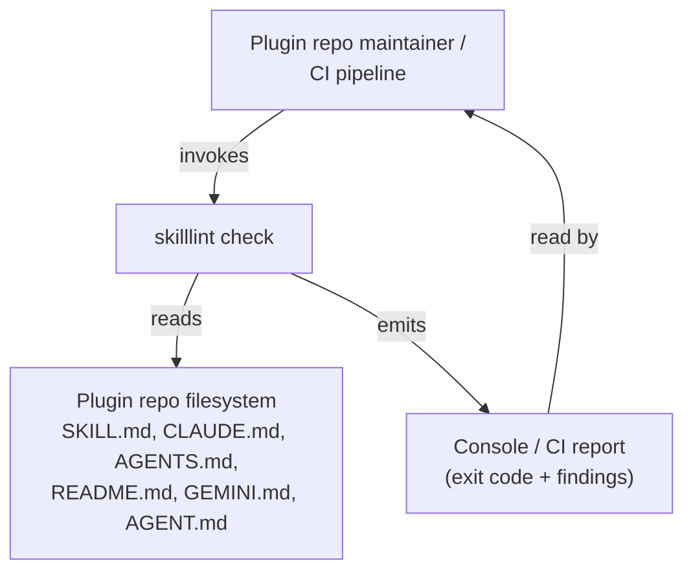
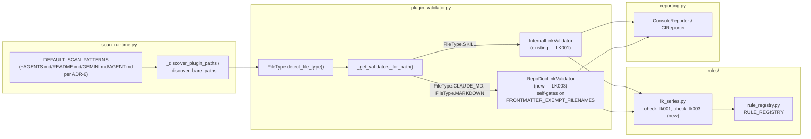

# Design: Markdown Link Conventions — Closing the Link-Validation Gap

Status: revised (post-adversarial-review)
Author: python-cli-design-spec (architecture pass)
Depends on: `packages/skilllint/rules/lk_series.py`, `packages/skilllint/plugin_validator.py`,
`packages/skilllint/scan_runtime.py`, `docs/maintainer-extension-guide.md`,
`docs/design-rule-provenance-registry.md`, `docs/TYPING_POLICY.md`

---

## 1. Executive Summary

skilllint scans four categories of markdown across a Claude Code plugin repo — `SKILL.md`,
repo/plugin-root convention docs (`CLAUDE.md`, `AGENTS.md`, `README.md`, `GEMINI.md`,
`AGENT.md`), skill-internal supporting content (`references/*.md`, `resources/**`,
`scripts/**`), and subagent/slash-command files (`agents/*.md`, `commands/*.md`) — but only
the first category gets link-existence checking (`LK001`). This design closes that gap for
the one category where the convention is well evidenced **and reachable**, and explicitly
defers the other two.

This is a revision of an earlier draft. The adversarial review appended at the end of this
file found the first draft's rules were *correct but inert*: `DEFAULT_SCAN_PATTERNS` in
`scan_runtime.py` does not discover `AGENTS.md`, `README.md`, `GEMINI.md`, `AGENT.md`, or
`references/*.md` at all, so `uv run skilllint check .` measurably produced **zero** new
findings under the original design. This revision adopts the review's Alternative A in full:

1. **Repo/plugin-root convention docs** (`CLAUDE.md`, `AGENTS.md`, `README.md`, `GEMINI.md`,
   `AGENT.md`) — add **`LK003`**, a broken-link existence check resolved against each file's
   own directory, gated to exactly these five filenames via the existing
   `FRONTMATTER_EXEMPT_FILENAMES` constant. To make it reachable, extend
   `DEFAULT_SCAN_PATTERNS` and `_discover_plugin_paths` to discover the four filenames that
   are missing today (`CLAUDE.md` is already discovered) — see ADR-6.
2. **Skill-internal supporting content** (`references/*.md` and friends) — **deferred**, same
   status as Category D. The earlier draft's `PD004` compromise (flag link presence without
   checking existence) is dropped: it was unreachable by discovery for the same reason as
   `LK003` was, and even discovery aside, measured signal in this repo is 2 findings out of 66
   reference files, both in vendored third-party content, zero in this repo's own `plugins/`
   tree. See ADR-3.
3. **Subagent/slash-command files** (`agents/*.md`, `commands/*.md`) — **deferred**. No
   Claude Code documentation defines any link-following behavior for these files, and this is
   the one category auto-discovery *does* already reach — which makes shipping an unsourced
   rule here riskier, not safer, than deferring it. See ADR-4.

`LK002` stays retired (see `lk_series.py`'s module docstring) — this design does not reuse
that code.

---

## 2. Architecture Overview

### 2.1 C4 Context



### 2.2 C4 Container — link-validation path



---

## 3. Technology Stack

No new dependencies. This feature is additive within the existing stack documented in
`architecture-spec-patterns.md`:

| Concern | Choice | Why (project-specific) |
|---|---|---|
| Rule registration | `@skilllint_rule` decorator (`rule_registry.py`) | Existing mechanism; every rule in the codebase registers this way, including `LK001` |
| Data model | `ValidationIssue` (Pydantic, `model_config = ConfigDict(frozen=True)`) | Existing model; `code` field already enforces `^[A-Z]{2}\d{3}$`, so `LK003` needs no schema change |
| Link extraction | `lk_series.py`'s existing `_iter_links` / `_strip_code_blocks` / `_should_ignore_link` | Root-agnostic already (pure text → tuples); no new parsing library needed |
| Discovery | `scan_runtime.py`'s existing `DEFAULT_SCAN_PATTERNS` glob mechanism | Extended, not replaced — see ADR-6 |
| Type checking | `ty` | Project standard; see §6 |
| Testing | `pytest` + `pytest-mock` + `hypothesis` | Matches `test_internal_link_validator.py`'s existing pattern |

---

## 4. Component Design

### 4.1 `packages/skilllint/rules/lk_series.py` — extend, do not replace

**Reused as-is** (no signature change): `LINK_PATTERN`, `CODE_FENCE_PATTERN`,
`INLINE_CODE_PATTERN`, `_strip_code_blocks`, `_should_ignore_link`, `_iter_links`. These
functions never took a resolution root — they operate on raw text and yield
`(link_text, link_url, link_url_no_fragment)` triples. Nothing about them assumed
`SKILL.md`; `check_lk001` was the only place that hardcoded `path.parent` as the resolution
root and attempted `${CLAUDE_*}` substitution. `check_lk003` reuses `path.parent` as its root
too (each file's own directory), so no root parameter needs to be threaded through the shared
helpers — only the existence-check loop itself is factored out (ADR-5, confirmed sound by
adversarial review — do not generalize the extraction helpers further).

**New — extracted from `check_lk001`'s body, used by both `check_lk001` and `check_lk003`:**

```python
def _resolve_link_target(link_url_no_fragment: str, base_dir: Path, *, substitute_claude_vars: bool) -> Path | None:
    """Resolve a relative link URL to an absolute Path, or None to skip the link.

    When substitute_claude_vars is True, applies the existing
    _resolve_claude_variables() substitution (SKILL.md only — see ADR-2).
    When False, any link containing a ${...} token is skipped outright:
    substitution semantics are undefined outside SKILL.md content per
    code.claude.com/docs/en/skills.md#available-string-substitutions, so
    skilllint has no basis for asserting the literal, unsubstituted path
    is broken.
    """
```

**New — LK003:**

```python
@skilllint_rule(
    "LK003",
    severity="error",
    category="link",
    platforms=["agentskills"],
    authority={"origin": "code.claude.com/docs/en/memory.md"},
)
def check_lk003(content: str, path: Path) -> list[ValidationIssue]:
    """## LK003 — Broken internal link in a repo/plugin-root convention doc

    A relative markdown link in CLAUDE.md, AGENTS.md, README.md, GEMINI.md, or
    AGENT.md points to a file that does not exist, resolved against the
    linking file's own directory (see ADR-2 for the evidence backing this
    root and its confidence level — the cited doc sentence covers Claude
    Code's `@import` mechanism, not plain markdown links, and this claim
    is extended to plain links by directional evidence, not a literal
    citation for this exact syntax).

    <!-- examples: LK003 -->
    """
```

`check_lk003` calls `_resolve_link_target(url, path.parent, substitute_claude_vars=False)`
for each `_iter_links(content)` triple and reports `LK003` when the resolved path is not
`None` and does not exist — structurally the same loop `check_lk001` already runs, sharing
`_resolve_link_target` rather than duplicating it. The `<!-- examples: LK003 -->` marker is
required — every existing rule docstring carries one, and `_render_examples_block`
(`plugin_validator.py`) expands it in `skilllint rule LK003` output.

### 4.2 `packages/skilllint/plugin_validator.py` — new validator class, filename gate, dispatch wiring

`RepoDocLinkValidator` follows the existing thin-wrapper pattern (`InternalLinkValidator`):
read the file, call the rule function, package results into a `ValidationResult`. Cannot
auto-fix (matches `InternalLinkValidator.can_fix()`, `False` today for the same class of
problem: fixing requires a human decision about content, not a mechanical rewrite).

**Filename gate — the actual fix for the adversarial review's false-positive finding.** The
first draft proposed dispatching `RepoDocLinkValidator` for the entire `FileType.MARKDOWN`
bucket with no further narrowing, reasoning that a filename gate would be "new dispatch
machinery." The review measured that reasoning as wrong: `InternalLinkValidator.validate()`
already opens with exactly this kind of one-line filename guard
(`if path.name != "SKILL.md": return ValidationResult(passed=True, ...)`), and the exact
five-name target set already exists as a named constant, `FRONTMATTER_EXEMPT_FILENAMES`
(`plugin_validator.py:582-588`: `{"AGENT.md", "AGENTS.md", "GEMINI.md", "CLAUDE.md",
"README.md"}`). Ungated, the rule produced 9 findings across the `FileType.MARKDOWN` bucket
on this repo, 0 of them in a Category-B doc and 7 of 9 regex artifacts from Shiki-HTML vendor
captures under `.claude/vendor/sources/`. `RepoDocLinkValidator` therefore gates itself the
same way `InternalLinkValidator` does:

```python
class RepoDocLinkValidator:
    """Validates internal markdown links in repo/plugin-root convention docs (LK003).

    Gates on FRONTMATTER_EXEMPT_FILENAMES ({"AGENT.md", "AGENTS.md", "GEMINI.md",
    "CLAUDE.md", "README.md"}) -- the same five-name set that already exempts
    these filenames from the frontmatter requirement. Any other file reaching
    this validator (e.g. a Shiki-HTML vendor capture classified as
    FileType.MARKDOWN) is skipped, not scanned.
    """

    def validate(self, path: Path) -> ValidationResult: ...
    # if path.name not in FRONTMATTER_EXEMPT_FILENAMES:
    #     return ValidationResult(passed=True, errors=[], warnings=[], info=[])
    def can_fix(self) -> bool: ...  # False
    def fix(self, path: Path) -> list[str]: ...  # raises NotImplementedError
```

**Dispatch change in `_get_validators_for_path`** — the only existing function that decides
which validators run per file type. Current relevant branch:

```python
elif file_type in {FileType.CLAUDE_MD, FileType.REFERENCE, FileType.MARKDOWN}:
    validators.append(MarkdownTokenCounter())
```

New branch. `FileType.REFERENCE` is untouched (Category C is deferred — ADR-3); `CLAUDE_MD`
and `MARKDOWN` both gain `RepoDocLinkValidator()`, whose own internal filename gate (above) is
what actually narrows the five target files out of the whole bucket — the dispatch layer
itself stays as coarse-grained as it is today for every other validator in this codebase:

```python
elif file_type in {FileType.CLAUDE_MD, FileType.MARKDOWN}:
    validators.extend([MarkdownTokenCounter(), RepoDocLinkValidator()])
elif file_type == FileType.REFERENCE:
    validators.append(MarkdownTokenCounter())
```

`FileType.AGENT` and `FileType.COMMAND` (Category D) are untouched — they continue through
the `_NAME_BEARING_FILE_TYPES` branch exactly as today, receiving no link validator (ADR-4).

**Registry updates required** (`RepoDocLinkValidator`, `LINT` ownership, matching
`InternalLinkValidator`'s existing entry):

```python
VALIDATOR_OWNERSHIP: dict[str, ValidatorOwnership] = {
    # ... existing entries ...
    "RepoDocLinkValidator": ValidatorOwnership.LINT
}

VALIDATOR_CONSTRAINT_SCOPES: dict[str, set[str]] = {
    # ... existing entries ...
    "RepoDocLinkValidator": {"shared", "provider_specific"}
}
```

**`ErrorCode` StrEnum** (`plugin_validator.py:341-349`) gains a member, and the module-level
alias block (lines 423-424) is updated to export it — `test_docs_url_parity.py` parametrizes
over `list(ErrorCode)`, so omitting this silently drops `LK003` from that parity check:

```python
class ErrorCode(StrEnum):
    ...
    # Link (LK001, LK003)
    LK001 = "LK001"  # Broken internal link (file does not exist)
    LK003 = "LK003"  # Broken internal link in a repo/plugin-root convention doc
    ...


# Module-level aliases (replaces the existing single-value `LK001 = ErrorCode.LK001`):
LK001, LK003 = ErrorCode.LK001, ErrorCode.LK003
```

### 4.3 `packages/skilllint/scan_runtime.py` — discovery pattern extension (ADR-6)

Without this, `LK003` is unreachable by `skilllint check <directory>` — see ADR-6 for the
measured evidence. Two additions, both extending existing mechanisms with no new discovery
machinery:

```python
DEFAULT_SCAN_PATTERNS: tuple[str, ...] = (
    "**/skills/*/SKILL.md",
    "**/agents/*.md",
    "**/commands/*.md",
    "**/.claude-plugin/plugin.json",
    "**/hooks/hooks.json",
    "**/CLAUDE.md",
    "**/AGENTS.md",  # new
    "**/README.md",  # new
    "**/GEMINI.md",  # new
    "**/AGENT.md",  # new
)
```

`_discover_plugin_paths` gains four blocks alongside its existing `CLAUDE.md` block (same
exists-then-add pattern, so a plugin root without one of these files is unaffected):

```python
if (root / "CLAUDE.md").exists():
    discovered.add(root / "CLAUDE.md")
if (root / "AGENTS.md").exists():  # new
    discovered.add(root / "AGENTS.md")
if (root / "README.md").exists():  # new
    discovered.add(root / "README.md")
if (root / "GEMINI.md").exists():  # new
    discovered.add(root / "GEMINI.md")
if (root / "AGENT.md").exists():  # new
    discovered.add(root / "AGENT.md")
```

`_discover_provider_paths` and `_discover_bare_paths` need no direct change — the former
does not target repo/plugin-root docs at all (out of scope for provider-directory scans), and
the latter already iterates `DEFAULT_SCAN_PATTERNS` generically, so the four new glob entries
flow through it automatically.

**Side effect that must be measured, not assumed (§8 has the explicit verification step):**
every newly-discovered file also picks up whatever else `_get_validators_for_path` attaches
to `FileType.CLAUDE_MD`/`FileType.MARKDOWN` — today that is `MarkdownTokenCounter()`
(`TC001`, info-level) and the universal `SymlinkTargetValidator()`. This is a real, visible
change to `skilllint check`'s output on every repo that has an `AGENTS.md`/`README.md`, not
just a discovery-plumbing detail.

---

## 5. Data Architecture

No new persisted configuration and no schema changes. The single shared data model is the
existing `ValidationIssue` Pydantic model in `plugin_validator.py`:

```python
class ValidationIssue(BaseModel):
    model_config = ConfigDict(frozen=True)
    field: str
    severity: Literal["error", "warning", "info"]
    message: str
    code: Annotated[str, Field(pattern=r"^[A-Z]{2}\d{3}$")]
    line: int | None = None
    # ... existing fields unchanged
```

`LK003` satisfies `^[A-Z]{2}\d{3}$` — no `Field` constraint change needed. No new config
file, no new CLI flag: `LK003` runs automatically wherever `RepoDocLinkValidator` is
dispatched for a matching filename — i.e., wherever the file is discovered by
`scan_runtime.py`'s `DEFAULT_SCAN_PATTERNS` **as extended by ADR-6 (§10)**, or passed
explicitly as a path argument. Before ADR-6's discovery extension, that reach is limited to
`CLAUDE.md` plus whatever a caller hand-types; after it, `AGENTS.md`/`README.md`/`GEMINI.md`/
`AGENT.md` at every discovered plugin root are reached too.

---

## 6. Type System Design

### 6.1 Domain identifier inventory

No new domain identifier types are required. `FileType` (existing `StrEnum`) already
discriminates every file category this design touches (`CLAUDE_MD`, `MARKDOWN`, `AGENT`,
`COMMAND`, `REFERENCE`); rule codes already satisfy the existing regex-constrained `str`
field on `ValidationIssue.code`, and `ErrorCode` (existing `StrEnum`, §4.2) gains one member.
`LK003` is a new *value* of an existing, already-validated domain, not a new *type*.

### 6.2 Boundary validation map

The only I/O boundary this design touches is `path.read_text(encoding="utf-8")`, which
already exists (both `InternalLinkValidator.validate()` today and the new
`RepoDocLinkValidator.validate()` perform the same read, with the same `OSError` →
`FM002`-coded issue handling `InternalLinkValidator` already uses). No new external, network,
or subprocess data enters the system.

Per `docs/TYPING_POLICY.md` §4, a typed boundary is where *raw, external, or untrusted* input
enters. Markdown file content read from the local plugin repo under scan is the same trust
class `check_lk001` already processes today via plain `re.finditer` over `str` — it is not
schema-shaped external data (an API response, a config file with a defined shape), so it does
not require a `TypedDict`/Pydantic ingestion model. This mirrors the existing convention
across every file in `rules/`: link/text extraction stays on `str` and `tuple[str, str, str]`,
not modeled types, because the module is scanning free-text markdown, not deserializing a
structured payload. Introducing a Pydantic model here would be boundary machinery without a
boundary — the repo's own no-invented-constraints rule.

### 6.3 Type contracts

| Identifier | Definition | Creation | Validation | Consumption | Serialization |
|---|---|---|---|---|---|
| `rule_code` (`"LK003"`) | `Annotated[str, Field(pattern=r"^[A-Z]{2}\d{3}$")]` on `ValidationIssue.code` (existing); `ErrorCode.LK003` member (§4.2) | Literal string argument to `_make_issue(code=...)` inside `check_lk003` | Pydantic pattern constraint at `ValidationIssue` construction (existing, unchanged) | `reporting.py` reporters, `rule` / `rules` CLI commands, `test_docs_url_parity.py` (parametrizes `list(ErrorCode)`), `assert_rules_completeness.py` (series-prefix count only) | `ValidationIssue.model_dump()` → JSON in `CIReporter`; unchanged |
| `resolved_link_target` (`Path \| None`) | Return type of new `_resolve_link_target()` | Inside `_resolve_link_target`, from `(base_dir / url).resolve()` | `None` sentinel means "skip — no basis to assert broken" (existing pattern from `_resolve_claude_variables`, reused as a sentinel convention, not reused as code) | `check_lk001` and `check_lk003` existence-check loops only | N/A — never serialized, resolved within a single rule-function call |

### 6.4 Weak type audit

No `Any`, `object`, or `cast()` introduced anywhere in this design. `_resolve_link_target`
returns `Path | None` (a real union, not `Any`); callers must handle both branches explicitly
before dereferencing. `ty check packages/` is the sole type checker per this project's policy
(mypy/basedpyright intentionally off) — this design introduces nothing that requires either.
Confirmed sound by adversarial review; no changes from the prior draft.

---

## 7. Security Architecture

- **No new external I/O.** `RepoDocLinkValidator` reads only files already inside the scanned
  plugin repo tree, using the same `path.read_text(encoding="utf-8")` call
  `InternalLinkValidator` uses today.
- **No new subprocess, network, or credential surface.** Nothing in this design touches
  `subprocess`, environment variables, or secret storage.
- **Path resolution is existence-checking, not file access control.** `_resolve_link_target`
  calls `.resolve()` then `.exists()`, exactly as `check_lk001` does today — this can walk
  outside the plugin tree via `../` segments and report on files it finds there, but it never
  reads, executes, or writes the target; it only reports true/false existence. This is the
  same trust model `LK001` has operated under since its introduction, and is not a new
  security surface. (The pre-existing `../`-walk ambiguity for `SKILL.md` links is explicitly
  out of scope per §12 — this design neither fixes nor worsens it.)
- **Security checklist** (from `architecture-spec-patterns.md`): path traversal — no
  mitigation needed beyond existing `LK001` behavior (read-only existence check, not a file
  access boundary); command injection — N/A, no subprocess calls added; secure temp files —
  N/A; rate limiting — N/A, no API calls; certificate validation — N/A, no HTTPS calls.

Confirmed sound by adversarial review; no changes from the prior draft.

---

## 8. Testing Architecture

### 8.1 Test files

```text
packages/skilllint/tests/
├── test_repo_doc_link_validator.py       # LK003 — filter: -k lk003 or -k repo_doc_link
└── test_scan_runtime.py                  # extended: discovery-reachability assertions (ADR-6)
```

`test_repo_doc_link_validator.py` follows `test_internal_link_validator.py`'s existing
structure (that file collects **29** tests, not 24 as an earlier draft of this spec claimed —
verified via `pytest --collect-only`): broken-link detection, valid-link pass-through,
external/anchor/absolute-link filtering (shared helper — verify the reused filter still
applies, not re-derive it), the `${...}`-token skip behavior (`LK003` skips unconditionally
per ADR-2; `check_lk001`'s existing substitution tests are untouched), and the filename-gate
behavior (§4.2) — a non-`FRONTMATTER_EXEMPT_FILENAMES` file with a genuinely broken link must
produce zero findings.

### 8.2 Required tests, written first (TDD — REQUIRED)

`test_internal_link_validator.py` imports the exact module this design changes
(`skilllint.rules.lk_series`), and the project is a CLI application — both independently
select TDD as required per this project's standard determination. Two tests are required —
conceptually the same two as before, but the first now has two sub-cases after the
verification pass found a real hole in it; write everything below **before**
implementation, confirm it is RED against the current codebase, then implement to GREEN:

1. **Discovery-reachability test — bare AND plugin context.** ADR-6 has two independent
   halves: the `DEFAULT_SCAN_PATTERNS` glob additions (reached via `_discover_bare_paths`)
   and the `_discover_plugin_paths` exists-then-add blocks. A bare-context `tmp_path` alone
   only exercises the first half — verified: with only the `DEFAULT_SCAN_PATTERNS` half
   applied, a bare `tmp_path` finds all five target filenames (test would go GREEN), while a
   *plugin*-context `tmp_path` (one containing `.claude-plugin/plugin.json`) still finds
   **zero** of them, because `_discover_bare_paths` filters out any glob match under a
   `covered_root`. An implementer could ship only that half, pass a bare-only test, and leave
   every plugin-root `README.md`/`AGENTS.md` unreachable — the same shape of gap the first
   review pass caught, just moved one directory level down. This is the one required test
   that actually guards a real defect; the two sub-cases are both mandatory:
   - **Bare case**: build a `tmp_path` directory (no `.claude-plugin/plugin.json`) containing
     `AGENTS.md`, `README.md`, `GEMINI.md`, `AGENT.md`, `CLAUDE.md`; assert
     `_discover_validatable_paths(tmp_path)` returns all five.
   - **Plugin case**: build a `tmp_path` directory containing `.claude-plugin/plugin.json`
     plus the same five filenames at its root; assert `_discover_validatable_paths(tmp_path)`
     returns all five. This case is RED under the `DEFAULT_SCAN_PATTERNS` half alone and
     GREEN only once `_discover_plugin_paths` is also extended — it is the only test that
     pins that half of ADR-6.
   **Both cases fail against the current codebase today** — write them first.
2. **Vendor-doc false-positive guard**: feed `RepoDocLinkValidator` a file named
   `some-doc.md` (i.e. *not* in `FRONTMATTER_EXEMPT_FILENAMES`) whose body is a real Shiki-HTML
   `<span>` snippet copied from `.claude/vendor/sources/claude-code--skills-*.md`
   (`LINK_PATTERN` matches bracket/paren sequences inside that markup); assert **zero**
   issues. This is the regression guard for §4.2's filename gate.

`@given`/Hypothesis on `_resolve_link_target` (below) is a reasonable addition but does not
substitute for either of these two — neither defect was a property-testable invariant, both
were reachability/gating decisions.

### 8.3 Fixtures

Located under the existing `_FIXTURES_ROOT` convention
(`packages/skilllint/tests/fixtures/providers/agentskills/{failing,passing}-examples/`), not
a new top-level directory — the prior draft proposed `tests/fixtures/link_conventions/`,
which sits outside that root and would leave `skilllint rule LK003` printing "No fixture
examples available yet":

```text
packages/skilllint/tests/fixtures/providers/agentskills/
├── failing-examples/LK003/
│   ├── AGENTS.md          # [Guide](docs/missing.md)  -> does not exist
│   ├── README.md          # [Ref](./nope/thing.md)    -> does not exist
│   └── CLAUDE.md          # [Notes](sub/gone.md)      -> does not exist
└── passing-examples/LK003/
    ├── AGENTS.md          # [Guide](docs/real.md)     -> exists
    ├── docs/real.md
    ├── README.md          # [Ref](./sub/there.md), [Ext](https://x.test), [A](#anchor)
    ├── sub/there.md
    ├── CLAUDE.md          # @AGENTS.md  (import syntax — must NOT be flagged)
    └── not-a-convention-doc.md  # [X](totally-missing.md) — must NOT be flagged (filename gate)
```

`LK001`/`PD001` ship with no committed example fixtures either, so omitting them would also be
within precedent — this design chooses to add them because the filename-gate and `@import`
non-flagging behaviors are exactly the two properties an adversarial reviewer already
struggled to verify without a committed example.

### 8.4 Property-based testing (Hypothesis)

`_resolve_link_target` is the shared logic `check_lk001` and `check_lk003` both exercise;
property-test it directly:

- **Invariant**: for any generated relative path string without a `${...}` token, the
  function's `Path | None` result agrees with a direct `(base_dir / url).resolve().exists()`
  check on the same generated filesystem fixture.
- **Invariant**: for any generated URL containing a `${...}`-shaped token
  (`CLAUDE_VAR_PATTERN`), `_resolve_link_target(..., substitute_claude_vars=False)` always
  returns `None` regardless of whether a file happens to exist at the literal unsubstituted
  path.

`@given` with `hypothesis.strategies`, `@settings(max_examples=500)` per
`testing-spec-guidance.md`'s property-based testing guidance for validation functions.

### 8.5 Coverage target

80% line and branch coverage (project default; this is not payment/auth/security-critical
code, so the 95%+/mutation-testing tier does not apply). **Correction from the prior draft:**
`[tool.coverage.report] fail_under` in `pyproject.toml` is **60**, not 80
(`pyproject.toml:129`) — the project-wide gate is 60%; this feature still targets 80% for its
own new code as the design-level bar, but must not assume the repo-wide `fail_under` enforces
that number itself. No `pyproject.toml` change is required either way.

### 8.6 Pre-ship verification (ADR-6 side effect — explicit step, not a footnote)

Extending `DEFAULT_SCAN_PATTERNS` widens the scan set on every repo with an
`AGENTS.md`/`README.md`/`GEMINI.md`/`AGENT.md`, not just this one. Measured on this repo:
discovery grows from 72 to **77** paths (**+5**, not +4) once both halves of ADR-6 are
applied. The fifth addition is not a Category-B doc: `**/AGENTS.md` also newly discovers
`packages/skilllint/tests/fixtures/codex/{empty,valid}/AGENTS.md`, skilllint's own
negative-test fixtures for `CX001` (one is a 1-byte file whose entire content is a single
newline, deliberately invalid). So the actual `LK003`-reachable gate-name set on this repo is
**6 files, not 4**: `CLAUDE.md`, `AGENTS.md`, `README.md`,
`plugins/agentskills-skilllint/README.md`, and the two `.../codex/{empty,valid}/AGENTS.md`
fixtures. Harmless today — neither fixture contains a broken link, both currently produce only
`TC001` info — but real, and the expected delta below must say so rather than imply only the
four repo/plugin-root docs are affected.

Before this change is merged:

1. Run `uv run skilllint check .` before and after the change on this repo and on
   `tests/fixtures/benchmark-plugin-1000-skills.zip` / `benchmark-plugin-violations.zip`;
   diff the output. Expected delta: 5 newly-discovered files (including the 2 `codex/*/
   AGENTS.md` test fixtures), each contributing one `TC001` info line from
   `MarkdownTokenCounter()`. **Do not gate this on exit code** — `uv run skilllint check .`
   on this repo already fails today (`Total files: 71, Passed: 62, Failed: 9, Warnings: 16`,
   unrelated to this change), so the exit code is already non-zero and "unchanged" would be
   trivially true regardless of whether `LK003` works correctly. Compare **finding counts**
   instead: `LK003` findings must be 0 on this repo's current content, and the total
   failed-file count must not increase beyond what is attributable to genuinely new, correct
   findings.
2. Re-run `scripts/bench_io.py` before and after on the benchmark fixtures and compare
   wall-clock time — `**/README.md`/`**/AGENTS.md` glob the whole tree, so this is a real
   discovery-cost change, not a no-op. A regression greater than 10% needs an explanation
   before merge.

The full command sequence for both checks is recorded verbatim in this file's own
"Adversarial Review → Behavioral validation plan" section below (Phase 2e and Phase 3e) —
reuse those commands rather than re-deriving them.

---

## 9. Distribution Architecture

No change. skilllint is distributed as a Python package (`packages/skilllint/`), not a
standalone PEP 723 script — this feature adds one function to an existing module
(`lk_series.py`), one class to `plugin_validator.py`, and extends two existing constants in
`scan_runtime.py`. No new file needs a shebang or PEP 723 metadata block.

---

## 10. Architectural Decisions (ADRs)

### ADR-1: Fresh rule code — `LK003`; `LK002` stays retired

**Decision:** The Category B existence-checker uses `LK003` (next unused code in the LK
series).

**Rationale:** `LK002` was deleted because it asserted a `./`-prefix requirement with no
sourced justification and fired on both the AgentSkills spec's own worked example and
Anthropic's skills doc example (`lk_series.py` module docstring). Reusing `LK002` for an
unrelated rule would erase that history and risk a maintainer assuming the retired rule was
reinstated. `LK003` is confirmed free by inspection of `RULE_REGISTRY` (`lk_series.py`
registers `LK001` only). An earlier draft of this design also proposed `PD004` for Category
C; that rule is dropped entirely in this revision (ADR-3) — the earlier draft's reasoning for
using `PD004` rather than `LK004` (grouping by *what the rule asserts* — existence vs.
structure — rather than by *what kind of file it looks at*) remains sound in principle and is
worth keeping in mind if Category C existence-checking is ever built as a follow-up, but there
is no live rule for that reasoning to apply to right now.

### ADR-2: Category B — file's-own-directory root, plain links only, no `${CLAUDE_*}` substitution

**Decision:** `LK003` resolves each link against `path.parent` (the linking file's own
directory). It processes only plain `[text](url)` markdown links. It does not evaluate
Claude Code's `@path/to/import` memory-import syntax. It does not attempt `${CLAUDE_*}`
substitution — any link containing a `${...}` token is skipped, not flagged.

**Rationale:**

- **Root.** Claude Code's memory-import documentation
  (`code.claude.com/docs/en/memory.md`, "Import additional files") states explicitly that
  relative import paths "resolve relative to the file containing the import, not the working
  directory." That sentence is written for the `@import` mechanism, not plain markdown links,
  so it is not a literal citation for this rule — but this repo's own two working examples
  (`README.md:508` → `docs/ignore-config.md`, resolved against the repo-root README's own
  directory; `plugins/agentskills-skilllint/README.md:68` → `./skills/skilllint/references/
  rule-catalog.md`, resolved against *that* README's own directory, not the repo root) both
  independently confirm file's-own-directory resolution for plain links too. Confidence: high,
  by directional evidence plus internal repo consistency, not by a single documented sentence
  that covers the exact syntax being checked. This caveat is recorded in the rule's own
  docstring (§4.1) — per ADR-1/§11, `LK003` gets **no** provenance-registry entry (matching
  `LK001`'s existing convention), so the docstring is where a human reads this distinction,
  not a machine-checked claim record.
- **Plain links only, not `@import`.** `@import` is a materially different feature: it
  supports absolute (`~/`-prefixed) paths, has a max recursion depth of 4, and gates imports
  that resolve outside the working directory behind a one-time approval dialog. None of those
  exception rules apply to a plain `[text](url)` link, which Claude Code does not parse or
  dereference at all — it exists for human/GitHub readers only. Building one checker that
  conflated both syntaxes would silently apply the wrong exception rules to one of them.
  `@import` existence-checking is explicitly out of scope (§12) and left as a candidate for a
  future, separate rule.
- **No `${CLAUDE_*}` substitution.** The substitution variables are documented to apply in
  exactly two places: "the skill's markdown content, and Bash rules in the `allowed-tools`
  frontmatter" (`code.claude.com/docs/en/skills.md#available-string-substitutions`) — i.e.
  `SKILL.md` only. Applying `_resolve_claude_variables` to `CLAUDE.md`/`AGENTS.md`/etc. would
  assert a substitution behavior the documentation does not claim exists for those files.
  Skipping (rather than flagging as broken) any link containing a `${...}` token is the
  conservative choice: a literal, unsubstituted `${...}` path is unlikely to exist on disk,
  and flagging it would produce a near-certain false positive on any convention doc that uses
  `${...}` syntax for illustrative purposes.

**Confidence:** High for the root; explicitly not claimed as a literal documented rule for
plain-link syntax specifically. Confirmed sound by adversarial review, including the
docstring-vs-registry distinction above (previously mis-stated as living in a provenance
registry entry — corrected per ADR-1/§11).

### ADR-3: Category C — deferred (revised: reachability and measured signal, not "no evidence for a root")

**Decision:** Do not add any link rule — existence-checker or presence-flagger — for links
inside `references/*.md`, `resources/**`, or `scripts/**` in this iteration. This supersedes
the prior draft's `PD004` compromise, which is dropped entirely.

**Why the prior reasoning was replaced.** The first draft argued `references/*.md` should not
get an existence-checker because no documented resolution root exists for it, while granting
`LK003` a file's-own-directory root on CommonMark-default plus repo-example evidence. The
adversarial review correctly identified this as asymmetric: a `references/*.md` file is
rendered by GitHub under the identical CommonMark relative-path semantics as a `README.md` —
the *only* thing that changes between the two categories is the filename, not the applicable
resolution convention. If CommonMark-default reasoning is adequate evidence for `LK003`'s
root, it is equally adequate for a `references/*.md` existence-checker; the first draft could
not apply the standard in one direction only.

**Why the decision is still to defer, on the correct grounds:**

1. **Reachability.** No discovery pattern in `scan_runtime.py` reaches `references/*.md`
   today, and this design's `DEFAULT_SCAN_PATTERNS` change (ADR-6) does not add one — adding
   it would mean scanning every skill's reference material by default, a materially larger
   and unvalidated blast-radius change this iteration does not take on.
2. **Weak measured signal even if reachability were fixed.** Of 66 `FileType.REFERENCE`
   files in this repo, 2 contain any relative markdown link at all, and both are in vendored
   third-party content under `.claude/`, not this repo's own `plugins/` tree.
3. **The AgentSkills specification's own guidance** ("Keep file references one level deep
   from SKILL.md. Avoid deeply nested reference chains.") argues that reference files
   generally should not contain further links in the first place — which weakens the case for
   building an existence-checker for a pattern the spec itself discourages, independent of the
   reachability and signal points above.

No example of a `references/*.md` file containing a broken link exists anywhere in this repo
to validate against either way.

**Confidence:** The resolution-root question is no longer the blocking factor (see above) —
reachability and measured signal are. Revisit if `references/*.md` discovery is added for
other reasons and real broken-link signal is observed in practice.

### ADR-4: Category D — deferred, no rule added

**Decision:** No link validation of any kind is added for `agents/*.md` or `commands/*.md` in
this iteration.

**Rationale:** No Claude Code documentation defines any link convention for subagent or
slash-command files. The official commands documentation explicitly states skills are
recommended over commands specifically *because* skills "support additional features like
supporting files" — i.e., commands do not get `SKILL.md`'s link-dereferencing feature at all.
A subagent file's body "becomes the system prompt"; nothing in the documentation mentions
markdown-link parsing for it. **Correction from the prior draft:** the earlier claim that
"zero `agents/*.md`/`commands/*.md` files in this repo contain a markdown link" is false —
measured count is **1** file, **1** link, across 110 agent/command files. That single instance
does not establish a usage pattern to validate against, and the conclusion is unchanged: a
broken link here is, at most, a human-readability defect — it does not break any documented
runtime feature, unlike a broken `SKILL.md` link which breaks the documented "supporting
files" mechanism. Per the ladder in this project's own engineering discipline ("does this need
to exist at all?" before "how would we build it?"), the answer for this category this
iteration is no. `NamespaceReferenceValidator` (`NR001`/`NR002`) already validates a distinct,
unrelated reference syntax (`@plugin:agent-name`, `/plugin:skill-name`, `Skill()`, `Task()`)
in these same files — nothing here conflicts with or duplicates that.

**Note the inverted risk profile:** `agents/*.md` and `commands/*.md` are, in fact, the *one*
category in this whole design that auto-discovery already reliably reaches
(`DEFAULT_SCAN_PATTERNS` includes `**/agents/*.md` and `**/commands/*.md` today). A rule here
would actually fire on real scans, unlike the unreachable categories the first draft shipped
instead. That makes deferring Category D *more* conservative than it looks, not less — an
unsourced rule here would be immediately live, not inert.

**Revisit when:** either Claude Code documents link-following behavior for these files, or
real-world plugin repos accumulate markdown links in `agents/*.md`/`commands/*.md` that
maintainers want checked.

### ADR-5: `lk_series.py` helpers reused as-is; only the existence-check loop is factored out

**Decision:** `_iter_links`, `_strip_code_blocks`, `_should_ignore_link` are reused
unmodified — no resolution-root parameter is added to them, because none of them ever took
one. The only new shared code is `_resolve_link_target`, extracted from `check_lk001`'s
existence-check loop, parameterized by `base_dir: Path` and
`substitute_claude_vars: bool`.

**Rationale:** Both `check_lk001` (root = `SKILL.md`'s parent, substitution on) and
`check_lk003` (root = the convention doc's own parent, substitution off) always pass
`path.parent` as the root — every relevant file type in this design resolves against its own
directory. There is no case in this design where the root differs from `path.parent`, so
threading a caller-supplied root through the text-extraction helpers would be unused
generality. The one real behavioral difference between the two rules — whether `${CLAUDE_*}`
substitution is attempted — is exactly what `substitute_claude_vars` isolates. Confirmed
sound by adversarial review; do not generalize further.

### ADR-6: Extend `DEFAULT_SCAN_PATTERNS` and `_discover_plugin_paths` so `LK003` is reachable

**Decision:** Add `**/AGENTS.md`, `**/README.md`, `**/GEMINI.md`, `**/AGENT.md` to
`DEFAULT_SCAN_PATTERNS`, and add matching `if (root / "<name>").exists(): discovered.add(...)`
blocks to `_discover_plugin_paths`, next to the existing `CLAUDE.md` block (§4.3).

**Rationale.** Without this, `LK003` cannot fire under `skilllint check <directory>` at all
for four of its five target filenames. Measured on this repo:
`_discover_validatable_paths(repo_root)` returns 72 paths, of which `CLAUDE.md` accounts for
1 and `AGENTS.md`/`README.md`/`GEMINI.md`/`AGENT.md` account for 0 combined. The one file
`LK003` *could* reach without this change (`CLAUDE.md`) contains only `@AGENTS.md`, which
ADR-2 explicitly places out of scope — so without ADR-6, `LK003` would ship correct and
reachable-by-hand-typed-path, but produce zero findings under the normal `skilllint check .`
workflow this feature exists to serve.

**This is a genuine behavior change with its own blast radius**, not a plumbing detail: every
newly-discovered file also picks up whatever `_get_validators_for_path` already attaches to
`FileType.CLAUDE_MD`/`FileType.MARKDOWN` — currently `MarkdownTokenCounter()` (`TC001`,
info-level) and the universal `SymlinkTargetValidator()`. §8.6 makes measuring that delta
(via a before/after `skilllint check` diff and a `scripts/bench_io.py` comparison) an explicit
pre-merge verification step rather than an assumption.

**Alternative considered and rejected:** widen `InternalLinkValidator`'s existing
`SKILL.md`-only guard to also accept the five convention filenames, dispatching it (instead of
a new `RepoDocLinkValidator`) for `CLAUDE_MD`/`MARKDOWN`, and gate `${CLAUDE_*}` substitution
on `path.name == "SKILL.md"`. This is a smaller diff (no new rule code, no `ErrorCode`/catalog
churn) but conflates two distinct claims under one rule code: `LK001`'s docstring, catalog
entry, and fix note all say "in `SKILL.md`" today, and any existing ignore-config suppressing
`LK001` would silently start suppressing convention-doc findings too. Rejected in favor of
`LK003` as a separate code, preserving "one code, one claim."

---

## 11. Documentation & Registration Checklist

Every file that must change for this design to ship, and the exact edit required:

- **`plugins/agentskills-skilllint/skills/skilllint/references/rule-catalog.md`**
  - Add a row to the `## LK — Internal Link Rules` table:
    `| LK003 | error | no | Broken internal link in a repo/plugin-root convention doc (CLAUDE.md, AGENTS.md, README.md, GEMINI.md, AGENT.md) |`
  - Add a fix note below the table, matching the existing `LK001 fix:` note style:
    `**LK003 fix:** Links in these files are relative to that file's own directory, not the repo root. Verify the linked file path is correct relative to where the link is written.`
  - No `PD` table change — `PD004` is dropped (ADR-3).
- **`README.md`** (repo root) — update the `## What gets validated` table: change the
  `LK001` row's code column to `LK001, LK003` and description to add "; LK003 covers
  CLAUDE.md/AGENTS.md/README.md/GEMINI.md/AGENT.md, resolved against each file's own
  directory."
- **`plugins/agentskills-skilllint/README.md`** (the *second*, separate rule-series table at
  line 76 — missed by the prior draft, which updated only the root `README.md`): change the
  `| LK001 | Internal markdown links |` row to
  `| LK001, LK003 | Internal markdown links (LK003: repo/plugin-root convention docs) |`.
- **`packages/skilllint/schemas/provenance-registry.json`** — **no entry.** The registry's
  three existing claims all have `claim_type` in `{enum_set, scalar, pattern, field_set}`
  with a resolvable `assertion_location.symbol` that `test_provenance_registry_locators.py`
  imports and checks. `LK003`'s claim (a resolution-root *behavior*, `path.parent`) is none of
  those types and has no named constant to point at — inventing one purely to satisfy the
  registry schema would itself be an invented constraint. `LK001` and `PD001`–`PD003` already
  follow the correct convention: no registry entry, citation lives only in
  `@skilllint_rule(authority={...})`. `LK003` does the same. The ADR-2 caveat about the
  `memory.md` citation covering `@import` rather than plain links lives in the rule's own
  docstring (§4.1), where a human reads it.
- **`packages/skilllint/schemas/opinion-catalog.json`** — no entry; `LK003` is backed by a
  citation (however caveated), not an un-backed opinion.
- **`ErrorCode` StrEnum + module-level alias** (`plugin_validator.py:341-349`, `423-424`) —
  add `LK003 = "LK003"` and update the alias line to `LK001, LK003 = ErrorCode.LK001,
  ErrorCode.LK003`, per §4.2. Required so `test_docs_url_parity.py`'s
  `@pytest.mark.parametrize("code", list(ErrorCode))` covers the new code.
- **`packages/skilllint/rules/_constants.py`** — **no change.** `EXPECTED_SERIES` already
  contains `LK`; `MIN_REGISTERED_SERIES` is a series-prefix count, not a per-rule count.
- **`scripts/assert_rules_completeness.py`** — **no change.** It parses `skilllint rules`
  output for two-letter series prefixes only (`re.findall(r"\b([A-Z]{2})\d{3}\b", ...)`); it
  has no per-rule-code assertion to update.
- **`packages/skilllint/scan_runtime.py`** — `DEFAULT_SCAN_PATTERNS` and
  `_discover_plugin_paths` edits per ADR-6/§4.3.
- **`skilllint docs fetch-authorities`** — adding `code.claude.com/docs/en/memory.md` as a
  new `authority.origin` widens the URL set that command fetches. Expected and harmless; no
  action needed beyond awareness.
- **Registration mechanics** (`docs/maintainer-extension-guide.md` §3):
  - `@skilllint_rule("LK003", severity="error", category="link", platforms=["agentskills"], authority={"origin": "code.claude.com/docs/en/memory.md"})` on `check_lk003` in `lk_series.py`, with the `<!-- examples: LK003 -->` docstring marker (§4.1).
  - Add `RepoDocLinkValidator` to `_get_validators_for_path` per §4.2, with its own
    `FRONTMATTER_EXEMPT_FILENAMES` gate inside `validate()`.
  - Add `RepoDocLinkValidator` to `VALIDATOR_OWNERSHIP` (`LINT`) and
    `VALIDATOR_CONSTRAINT_SCOPES` (`{"shared", "provider_specific"}`) in `plugin_validator.py`.

---

## 12. Explicit Scope

### In scope

- `LK003`: broken-link existence check for the five filenames in
  `FRONTMATTER_EXEMPT_FILENAMES` (`CLAUDE.md`, `AGENTS.md`, `README.md`, `GEMINI.md`,
  `AGENT.md`), resolved against each linking file's own directory, plain `[text](url)` links
  only, gated at the validator layer (§4.2) — not a bucket-wide `FileType.MARKDOWN` rule.
  **Coverage is conditional on `FileType.detect_file_type`'s classification, not the filename
  alone.** `detect_file_type` checks `"agents" in path.parts`, `"commands" in path.parts`,
  `"hooks" in path.parts`, and `"references" in path.parts and path.suffix == ".md"` *before*
  it ever reaches the plain-`.md`/`CLAUDE_MD` branch — so a gate-name file living under one of
  those path segments (e.g. `agents/README.md`, `some/references/AGENTS.md`) classifies as
  `FileType.AGENT`/`FileType.REFERENCE`, not `FileType.CLAUDE_MD`/`FileType.MARKDOWN`, and
  `RepoDocLinkValidator` — dispatched only for the latter two — never sees it. No such file
  exists in this repo today (verified); this is a known, currently-latent limitation, not a
  claim of universal coverage, and this design does not fix it.
- Discovery pattern extension (ADR-6) so `LK003` actually fires under `skilllint check
  <directory>`, with the pre-merge verification step in §8.6.
- New test files, fixtures, and registration edits listed in §8 and §11.

### Out of scope (deferred, not silently assumed)

- **`@path/to/import` token checking** in `CLAUDE.md`/`CLAUDE.local.md` — a distinct syntax
  from plain markdown links, with its own exception rules (approval dialog, max recursion
  depth 4, `~/`-prefixed absolute paths). Candidate for a future, separate rule.
- **`SKILL.md`'s own upward-directory-walk ambiguity** (`../other-skill/x.md`) — pre-existing
  in `LK001`, not addressed or worsened by this design.
- **Category C — any link validation for `references/*.md`, `resources/**`, `scripts/**`**
  (ADR-3, revised) — fully deferred, same status as Category D. No `PD004` or equivalent ships
  in this iteration.
- **`${CLAUDE_*}` substitution outside `SKILL.md`** — undocumented either way for any file
  category this design touches; not attempted anywhere `LK003` runs (`SKILL.md`'s existing
  `LK001` behavior is unchanged).
- **Any link validation for `agents/*.md` or `commands/*.md`** (ADR-4) — fully deferred, even
  though this is the one category auto-discovery already reaches.
- **`GEMINI.md`/`AGENT.md`-specific verification against Gemini-CLI-specific documentation**
  — these two filenames are covered by `LK003` only by virtue of membership in
  `FRONTMATTER_EXEMPT_FILENAMES` alongside `AGENTS.md`/`README.md`; no Gemini-CLI-specific
  doc was consulted to confirm the convention independently for those two filenames.

---

## 13. Scalability Strategy

`LK003` itself runs synchronously within the existing per-file validation loop in
`scan_runtime.py`, at the same point `InternalLinkValidator` already runs — O(files × links
per file) regex scanning, identical complexity class to the existing `LK001`. That part is
unchanged from before and remains low-risk.

**Correction from the prior draft:** an earlier version of this section stated the design
"does not add new files to the scan set" as though that were a resource-management virtue.
The adversarial review identified this as the blocking defect, not a feature — a rule whose
entire target set is undiscovered validates nothing. ADR-6 deliberately *does* widen the scan
set: `**/AGENTS.md`, `**/README.md`, `**/GEMINI.md`, `**/AGENT.md` join
`DEFAULT_SCAN_PATTERNS`. The expected growth is bounded — at most one file per plugin root or
provider root per new filename, not proportional to skill or agent count — but `**/README.md`
in particular globs the entire directory tree on every scan, which is a real discovery-cost
change on large repos, not a bounded one. §8.6 requires a `scripts/bench_io.py` before/after
comparison before this ships specifically because the cost is not assumed to be negligible;
it must be measured.

---

## Adversarial Review

Reviewer: adversarial-solution-design (pre-implementation challenge pass)
Date: 2026-09-04
Method: every claim below was checked by running something in this session against the
worktree at `.claude/worktrees/soft-soaring-blossom` (branch `feat/lk-link-conventions`).
Claims I could not check are marked unverified inline.

**Overall: NEEDS REVISION.** The design is internally coherent, well-cited, and its ADRs are
mostly right — but it targets file categories the scanner does not discover. Measured on this
repo, shipping §12's "in scope" list exactly as written changes the output of
`uv run skilllint check .` by **zero findings**. The blocking defect is in §5/§13, not in the
rules themselves.

---

### Verdict per scrutiny point

#### 1. Is `LK003` numbered correctly? — CONFIRMED SOUND, one checklist omission

`LK003` is free. Verified: `RULE_REGISTRY` contains exactly one LK rule (`LK001`,
`lk_series.py:204`); `LK002` appears nowhere in `packages/` or `plugins/` outside the
retirement note in the `lk_series.py` module docstring and historical `.gsd/milestones/**`
findings reports. `PD004` is free — `pd_series.py` registers `PD001`–`PD003` only.
ADR-1's reasoning for not recycling `LK002` is correct and worth keeping.

**Omission:** `plugin_validator.py:341-349` defines an `ErrorCode(StrEnum)` with `LK001 =
"LK001"` and `PD001`–`PD003` members, plus module-level aliases at lines 423-424
(`LK001 = ErrorCode.LK001`, `PD001, PD002, PD003 = ...`). §11 never mentions it.

Not strictly load-bearing — `_make_issue` takes `code: str`
(`rule_registry.py:59-60`) and `ValidationIssue.code` is a regex-constrained `str`, so
emitting `"LK003"` works without an enum member. But `test_docs_url_parity.py:16` runs
`@pytest.mark.parametrize("code", list(ErrorCode))`, so omitting the members silently drops
the two new codes from that parity check. Make it an explicit decision in §11 rather than an
oversight, either way.

#### 2. Is bucket-wide `FileType.MARKDOWN` scope correct? — GAP FOUND (significant)

The spec's own rationale for applying `LK003` to the whole bucket is factually wrong.

> "inventing a new filename-discrimination layer purely for this feature would be new
> dispatch machinery with no evidence requirement behind it" — §4.3 scope note

Filename discrimination already exists at the **validator** layer, not the dispatch layer.
`InternalLinkValidator.validate()` (`plugin_validator.py:1472-1487`) opens with:

```python
# Only validate SKILL.md files
if path.name != "SKILL.md":
    # Not a skill file - skip validation
    return ValidationResult(passed=True, errors=errors, warnings=warnings, info=info)
```

Zero dispatch machinery. `RepoDocLinkValidator` gating itself the same way costs one line —
and the exact five-name set already exists as a named constant,
`FRONTMATTER_EXEMPT_FILENAMES` (`plugin_validator.py:582-588`):
`{"AGENT.md", "AGENTS.md", "GEMINI.md", "CLAUDE.md", "README.md"}`. That is precisely
Category B. The gate is `if path.name not in FRONTMATTER_EXEMPT_FILENAMES: return passed` —
an existing constant, an existing pattern, no new abstraction.

Note the spec also leaves `RepoDocLinkValidator.validate()`'s guard unspecified entirely
(§4.3 shows only `def validate(self, path: Path) -> ValidationResult: ...`), so an implementer
has to invent this decision anyway.

**Measured blast radius of the bucket-wide choice.** 501 `.md` files outside `.venv`/`.git`/
`node_modules` classify as: `markdown` 298, `command` 67, `reference` 66, `agent` 43,
`skill` 25, `claude_md` 2. Running `LK003`'s exact algorithm (`_iter_links` → skip `${...}`
→ `(path.parent / url).resolve().exists()`) across `MARKDOWN` + `CLAUDE_MD` yields **9
findings across 5 files, and not one is a Category-B convention doc**:

| File | Finding | Assessment |
|---|---|---|
| `.claude/vendor/sources/claude-code--skills-*.md` | x2 | False positive |
| `.claude/vendor/sources/claude-code--slash-commands-*.md` | x2 | False positive |
| `.claude/vendor/sources/slash-commands-*.md` | x2 | False positive |
| `.claude/vendor/sources/specification-*.md` | x1 | False positive |
| `.claude/plan/agentskills-skilllint/research-3-architecture.md` | x2 | Stale planning artifact |

The seven vendor-sources hits are a regex failure, not a broken link. Those files are Shiki
syntax-highlighted HTML captures, so `LINK_PATTERN` (`\[([^\]]+)\]\(([^)]+)\)`) matches across
`<span>` markup and yields URLs like:

```text
</span><span style="color:#1F2328;...">reference.md</span><span style="color:#1F2328;...">
```

`LK003` is `severity="error"`, so each of these fails the run with exit 1. Partial existing
mitigations: `.claude/vendor/` is gitignored (`.gitignore:53`, confirmed via `git check-ignore
-v`), and `check` skips gitignored paths unless `--include-gitignore` is passed. But
`.claude/plan/` is **not** gitignored, and there is no `.pluginvalidatorignore` anywhere in
this repo (verified by `find`). This repo also documents `skilllint docs fetch` as the
required way for agents to pull vendor docs to `.claude/vendor/sources/` (AGENTS.md), so this
file shape is a designed, recurring artifact — not an accident.

**Verdict:** filename-gate `LK003` to `FRONTMATTER_EXEMPT_FILENAMES`. This is strictly less
code than the spec proposes, reuses a constant already in the file, eliminates every measured
false positive, and makes the rule's name (`RepoDocLinkValidator`) true. §12's parenthetical
"(and any other file landing in `FileType.MARKDOWN`)" should be deleted.

#### 3. Does `PD004` deliver value? — GAP FOUND. Recommend cutting it from this iteration

Three independent problems.

**(a) It can never fire.** See point 6 below — `references/*.md` is in no discovery pattern.

**(b) Even if it could, the signal is near-empty.** Measured: of 66 `FileType.REFERENCE`
files in this repo, **2** contain any relative markdown link — `.claude/get-shit-done/
references/mvp-concepts.md` (1 link) and `.claude/skills/linear-walkthrough/references/
agent-instructions.md` (7 links). Both are vendored third-party skills under `.claude/`.
**Zero** files in this repo's own `plugins/` tree would be flagged, including
`plugins/agentskills-skilllint/skills/skilllint/references/rule-catalog.md`.

**(c) The "invented constraint" reasoning in ADR-3 is asymmetric.** ADR-2 justifies `LK003`'s
resolution root as "the CommonMark/GitHub default regardless of filename" plus two repo
examples. ADR-3 then refuses the same inference for `references/*.md` on the grounds that no
root is documented. But a `references/*.md` file is rendered by GitHub with the identical
CommonMark relative-path semantics — the *only* thing that changes is the filename. Either
the CommonMark default is adequate evidence for a resolution root (in which case
existence-checking reference files is exactly as justified as `LK003`) or it is not (in which
case `LK003`'s root rests on the same unsourced footing it accuses Category C of). The spec
cannot apply the standard in one direction only. As written, ADR-3's stated reason for
deferral does not hold; the *outcome* (defer) is still right, but for reason (a), not the one
given.

**Consistency defects if PD004 ships anyway:**

- Severity: spec proposes `warning`. All three sibling rules it invokes as precedent are
  `severity="info"` in code (`pd_series.py:88, 138, 190`) and all emit `severity="info"`
  through the shared `_check_disclosure_dir` helper. Justify the escalation or match.
- `plugins/agentskills-skilllint/skills/skilllint/references/rule-catalog.md:83-85` already
  disagrees with the code it documents: it lists PD001 as `warning` "Large skill … has no
  `references/` directory", PD002 as `warning` "`references/` exists but is not linked from
  SKILL.md", PD003 as `info` "Files in `references/` are never referenced". The code says
  info/info/info and missing-`references/` / missing-`examples/` / missing-`scripts/`.
  Appending a PD004 row (§11) to an already-drifted table propagates the drift. Either fix
  the table in the same change or note the pre-existing defect explicitly.
- ADR-1 leans on "exactly what PD001–003 already do for other structural properties (missing
  `references/`/`examples/`/`scripts/` directories)" — that description matches the **code**
  and is correct. Good; but it means the rule-catalog is the thing that's wrong.

#### 4. Is deferring Category D right? — CONFIRMED SOUND (with the reasoning partly inverted)

Steelmanning the alternative and rejecting it: `agents/*.md` and `commands/*.md` are the
**only** categories in this design that auto-discovery reliably reaches —
`DEFAULT_SCAN_PATTERNS` includes `**/agents/*.md` and `**/commands/*.md`
(`scan_runtime.py:40-48`), `_discover_plugin_paths` globs `agents/*.md` and `commands/*.md`
(lines 173-175), and `_discover_provider_paths` globs `agents/**/*.md` (line 237). A rule
here would actually fire on real scans. That makes shipping one *without* a sourced
convention riskier than shipping the unreachable rules, not safer. ADR-4's conclusion is
correct and its "revisit when" trigger is well-drawn.

The uncomfortable corollary the spec does not state: **it deferred the one reachable category
and shipped the two unreachable ones.** That inversion is the design's central problem.

One unverified claim to correct: ADR-4 asserts "Zero `agents/*.md`/`commands/*.md` files in
this repo contain a markdown link today." Measured: **1** file, **1** link, across 110
agent/command files. The conclusion (no meaningful usage pattern) survives; the stated fact
does not. Per AGENTS.md "Claims and Evidence", fix the sentence — an unverified claim in a
merged design doc becomes a premise later readers cite.

#### 5. Does `LK003` resolve correctly for every file it touches? — see point 2

Gated to `FRONTMATTER_EXEMPT_FILENAMES`: yes, correct for all five, and the two repo examples
ADR-2 cites (`README.md:508`, `plugins/agentskills-skilllint/README.md:68`) genuinely support
it. Ungated across `FileType.MARKDOWN`: no — measured above.

#### 6. Reachability — **BLOCKING GAP.** Neither rule fires under auto-discovery

This is the finding that changes the plan.

`DEFAULT_SCAN_PATTERNS` (`scan_runtime.py:40-48`) is:

```python
DEFAULT_SCAN_PATTERNS: tuple[str, ...] = (
    "**/skills/*/SKILL.md",
    "**/agents/*.md",
    "**/commands/*.md",
    "**/.claude-plugin/plugin.json",
    "**/hooks/hooks.json",
    "**/CLAUDE.md",
)
```

`AGENTS.md`, `README.md`, `GEMINI.md`, `AGENT.md`, and `references/*.md` appear in **no**
pattern. `_discover_plugin_paths` (lines 172-184) adds only `agents/*.md`, `commands/*.md`,
skill dirs, the plugin root, `hooks/hooks.json`, and `CLAUDE.md`.
`_discover_provider_paths` adds `agents/**/*.md` only.

Measured on this repo via `_discover_validatable_paths(repo_root)` — 72 paths discovered:

| Filename | Discovered |
|---|---|
| `CLAUDE.md` | 1 |
| `AGENTS.md` | 0 |
| `README.md` | 0 |
| `GEMINI.md` | 0 |
| `AGENT.md` | 0 |
| any `references/*.md` | 0 |

Consequences:

- **`LK003` reaches 1 of its 5 target filenames** under `skilllint check <dir>`.
- **`PD004` reaches nothing. Ever.** It would ship as dead code carrying a rule-catalog row, a
  README row, a provenance entry, a validator class, a test module, and eight fixtures.
- The single file `LK003` *can* reach in this repo is `CLAUDE.md`, whose entire body is:

  ```markdown
  # skilllint — Claude Development Notes

  @AGENTS.md
  ```

  That is an `@import`, which ADR-2 explicitly places out of scope. Plain relative links in
  it: **0**.

**Net measured effect of shipping §12 exactly as written on `uv run skilllint check .`:
zero findings.** Both rules are reachable only when a user hand-types a file path, e.g.
`uv run skilllint check README.md` (confirmed: that invocation runs `MarkdownTokenCounter`,
emits `TC001`, exits 0 — README is not reachable any other way).

The spec half-knows this and never resolves it:

- §5 says "wherever the file is discovered by the existing `scan_runtime.py` patterns or
  passed explicitly as a path argument — **see §11 for the discovery-pattern implication**."
  §11 is the Documentation & Registration Checklist and contains **no** discovery-pattern
  discussion. Dangling forward reference to content that was never written.
- §13 states "it does not add new files to the scan set" as though that were a virtue. For a
  rule whose entire target set is undiscovered, it is the defect.

**Required fix:** extending `DEFAULT_SCAN_PATTERNS` is a genuine behavior change with its own
blast radius (every newly-discovered file also starts getting `MarkdownTokenCounter`/`TC001`,
and `SymlinkTargetValidator`), so it needs its own ADR — but it cannot be silently omitted.
Minimum: add `**/AGENTS.md`, `**/README.md`, `**/GEMINI.md`, `**/AGENT.md` to
`DEFAULT_SCAN_PATTERNS` and the corresponding `(root / name).exists()` additions to
`_discover_plugin_paths` alongside the existing `CLAUDE.md` block. Then measure the `TC001`
delta before committing.

#### 7. Typing / boundary compliance — CONFIRMED SOUND, one false factual claim

- No `Any`, `object`, or `cast()` introduced. `_resolve_link_target -> Path | None` is a real
  union; both branches must be handled. Compliant with `docs/TYPING_POLICY.md` §2–§4.
- ADR-5's helper reuse introduces no boundary change. `_iter_links`, `_strip_code_blocks`,
  `_should_ignore_link` are already pure `str`-in / `tuple[str, str, str]`-out with no
  resolution root (verified, `lk_series.py:66-131`). Reusing them unmodified is correct and is
  the right rung — do not generalize them.
- §6.2's argument (free-text markdown is not schema-shaped external data, so no Pydantic
  ingestion model) matches the actual convention across every module in `rules/`. Adding a
  Pydantic model here would be boundary machinery without a boundary. Agreed.
- **False claim, §8.4:** "Existing `[tool.coverage.report] fail_under = 80` in
  `pyproject.toml` already enforces this — no config change required." Verified:
  `pyproject.toml:129` is `fail_under = 60`. The "no config change required" conclusion
  survives; the cited number does not. Fix the sentence.

#### 8. Documentation & Registration Checklist completeness — GAPS

Confirmed correct in §11:

- `VALIDATOR_OWNERSHIP` (`plugin_validator.py:471-487`) and `VALIDATOR_CONSTRAINT_SCOPES`
  (lines 521-538) both exist, and the proposed values (`LINT`,
  `{"shared", "provider_specific"}`) match every existing lint validator. Note both have
  `.get(..., default)` fallbacks returning exactly those values (lines 515, 549), and
  `PluginAgentFrontmatterValidator` is already dispatched without an entry in either — so
  these entries are conventional, not load-bearing. Harmless and consistent; keep.
- `packages/skilllint/rules/_constants.py` — **no change** is correct. `EXPECTED_SERIES`
  contains `LK` and `PD` already.
- `scripts/assert_rules_completeness.py` — **no change** is correct. Confirmed
  `test_rules_completeness.py:54` parses `\b([A-Z]{2})\d{3}\b` for series prefixes only.

Missing or wrong:

- **`ErrorCode` StrEnum + module-level aliases** — omitted entirely. See point 1.
- **provenance-registry.json entries are unimplementable as specified.** Verified: the
  registry has exactly **3** claims (`FM010.max_name_length`, `FM007.tool_field_names`,
  `SK004.max_description_length`). Every claim requires `claim_type` in
  `{enum_set, scalar, pattern, field_set}` (`design-rule-provenance-registry.md:136`), an
  `extraction.prompt_template` + `output_schema`, and an `assertion_location` with
  `source_type` in `{python_constant, schema_json_field, schema_json_enum}`.
  `test_provenance_registry_locators.py` imports each `python_constant` module and resolves
  its symbol. `LK003.link_resolution_root` is a resolution *behavior* (`path.parent`, an
  expression, not a named constant) and `PD004.avoid_nested_reference_chains` is a prose
  recommendation — neither is any of the four claim types and neither has a symbol to point
  at. Following §11 as written either fails that test or forces inventing a placeholder
  constant purely to satisfy it, which is itself an invented constraint.
  **Correct convention:** `LK001` and `PD001`–`PD003` have **no** provenance-registry entries
  at all; their citation lives in `@skilllint_rule(authority={...})`. Do that.
  Drop both proposed registry entries and keep the ADR-2 caveat in the rule docstring, where a
  human reads it.
- **`<!-- examples: RULE_ID -->` docstring marker** — every existing rule carries one
  (`check_lk001`, `check_pd001`–`003`); `_EXAMPLES_MARKER` /
  `_render_examples_block` (`plugin_validator.py:4502-4558`) expand it in `skilllint rule
  <CODE>` output. The two proposed docstrings in §4.1/§4.2 omit it.
- **Example-fixture location mismatch.** `_FIXTURES_ROOT` is
  `packages/skilllint/tests/fixtures/providers/`, and the convention is
  `{provider}/{failing,passing}-examples/{RULE_ID}/` (verified: `agentskills/failing-examples/`
  contains `AS008`, `FM001`–`FM010`). §8.2 proposes
  `packages/skilllint/tests/fixtures/link_conventions/`, which sits outside that root, so
  `skilllint rule LK003` would print "No fixture examples available yet." `LK001`/`PD001` have
  no example fixtures either, so precedent permits it — but the spec should say which
  convention it is choosing rather than appear unaware of the other.
- **Second rule table missed.** `plugins/agentskills-skilllint/README.md:76-77` carries its own
  `| LK001 | Internal markdown links |` / `| PD001–PD003 | ... |` table. §11 updates only the
  root `README.md`.
- **`skilllint docs fetch-authorities` side effect** (unverified impact): adding
  `code.claude.com/docs/en/memory.md` as a new `authority.origin` adds a URL to the set that
  command fetches. Probably fine; worth one line in §11.
- **§8.1 count is wrong** (and the task brief repeats it): `test_internal_link_validator.py`
  collects **29** tests, not 24. Verified via `pytest --collect-only`.

---

### Alternative approaches considered

#### Alternative A — `LK003` only, filename-gated, with discovery extended (RECOMMENDED)

Ship `LK003` gated to `FRONTMATTER_EXEMPT_FILENAMES` at the validator layer. Add
`**/AGENTS.md`, `**/README.md`, `**/GEMINI.md`, `**/AGENT.md` to `DEFAULT_SCAN_PATTERNS` and
to `_discover_plugin_paths` next to the existing `CLAUDE.md` block. Drop `PD004` entirely.
Keep ADR-1, ADR-2, ADR-4, ADR-5 as written; replace ADR-3 with "Category C deferred — not
reachable by discovery, and 2/66 measured signal"; add a new ADR for the discovery change.

- Cost: **low** — one rule, one one-line guard reusing an existing constant, ~6 lines of
  discovery patterns, one test module, one fixture pair.
- Risk: **medium**, and entirely concentrated in the discovery change: newly-discovered files
  also pick up `MarkdownTokenCounter` (`TC001` info) and `SymlinkTargetValidator`. Measure the
  `TC001` delta on this repo and on `tests/fixtures/benchmark-plugin-1000-skills.zip` before
  committing. The `LK003` rule itself is low-risk once gated — measured false positives drop
  from 7 to 0.
- Why recommended: it is the only option where the shipped rule demonstrably fires on real
  input, and it is a **smaller** diff than the spec (no `PD004` class, test module, catalog
  row, README row, provenance entry, or 2 fixtures).

#### Alternative B — Ship nothing new; widen `LK001`'s reach instead (SIMPLER)

Delete `InternalLinkValidator`'s `if path.name != "SKILL.md"` guard, widen it to
`{"SKILL.md"} | FRONTMATTER_EXEMPT_FILENAMES`, dispatch it for `CLAUDE_MD`/`MARKDOWN`, and
gate the `${CLAUDE_*}` substitution on `path.name == "SKILL.md"`. No new rule code, no
catalog/README/provenance/`ErrorCode` churn.

- Cost: **very low** — roughly 5 lines.
- Risk: **medium-high**. Conflates two claims under one code: `LK001`'s docstring, catalog
  entry, and fix note all say "in `SKILL.md`", and existing `.pluginvalidatorignore` /
  `ignore` configs suppressing `LK001` would silently start suppressing convention-doc
  findings too. ADR-1's "one code, one claim" discipline is worth more than 5 lines. Reject —
  but it is the honest simplest option and the spec should say why it loses.

#### Alternative C — Full spec plus existence-checking for `references/*.md` (MORE ROBUST)

`LK003` bucket-wide, plus a real `LK004` existence-checker for `references/*.md` resolved
against the file's own directory (the consistent application of ADR-2's CommonMark reasoning),
plus discovery patterns for both, plus `PD004`.

- Cost: **high** — two rules, two validators, discovery changes, ~16 fixtures.
- Risk: **high**. Inherits every measured `FileType.MARKDOWN` false positive, and newly scans
  66 reference files that have never been linted. Only worth it if a survey of external plugin
  repos (not this one) shows reference-file links are common and commonly broken — evidence
  nobody has gathered. Reject for this iteration; it is the right shape for a follow-up once
  Alternative A's discovery change has proven out.

---

### TDD determination: **REQUIRED**

Evidence:

- `packages/skilllint/tests/` exists and `test_internal_link_validator.py` imports the exact
  module being changed (`from skilllint.rules.lk_series import ...` / `InternalLinkValidator`),
  collecting **29** tests. First-match rule: tests exist and reference the affected module ->
  REQUIRED.
- Independently confirming: the project is a CLI app (`[project.scripts]` -> `skilllint`), which
  would yield RECOMMENDED on its own.
- `pytest` is available and green; `fail_under = 60` (`pyproject.toml:129`).

Order: `python-engineering:python-pytest-architect` writes `test_repo_doc_link_validator.py`
(and the discovery-pattern test) **first**, confirms RED, then
`python-engineering:python-cli-architect` implements to GREEN.

Two tests that must exist and that the spec's §8 does not currently imply — they are the
regression guards for the two defects found above:

1. **Reachability test** (this is the one that would have caught the blocking gap):
   build a `tmp_path` repo containing `AGENTS.md`, `README.md`, `GEMINI.md`, `AGENT.md`,
   `CLAUDE.md`, assert `_discover_validatable_paths(tmp_path)` returns all five. This test
   **fails on `main` today** — write it first.
2. **Vendor-doc false-positive guard:** feed `RepoDocLinkValidator` a file named
   `some-doc.md` whose body is a Shiki-style HTML span containing a bracket/paren sequence;
   assert **zero** issues (because the filename is not in `FRONTMATTER_EXEMPT_FILENAMES`).
   Copy a real snippet from `.claude/vendor/sources/claude-code--skills-*.md`.

`@given`/Hypothesis on `_resolve_link_target` per §8.3 is a reasonable addition but is not the
gap; do not let it substitute for the two above.

---

### Behavioral validation plan

Phase 1 and Phase 2 are the ones that matter here — a green Phase 1 alone would have passed
this design unchanged.

#### Fixtures to create

Under `packages/skilllint/tests/fixtures/providers/agentskills/` (the existing
`_FIXTURES_ROOT` convention — **not** `tests/fixtures/link_conventions/` as §8.2 proposes):

```text
failing-examples/LK003/
├── AGENTS.md          # [Guide](docs/missing.md)  -> does not exist
├── README.md          # [Ref](./nope/thing.md)    -> does not exist
└── CLAUDE.md          # [Notes](sub/gone.md)      -> does not exist
passing-examples/LK003/
├── AGENTS.md          # [Guide](docs/real.md)     -> exists
├── docs/real.md
├── README.md          # [Ref](./sub/there.md), [Ext](https://x.test), [A](#anchor)
├── sub/there.md
├── CLAUDE.md          # @AGENTS.md  (import syntax — must NOT be flagged)
└── not-a-convention-doc.md  # [X](totally-missing.md) — must NOT be flagged (filename gate)
```

Plus a throwaway integration fixture for the false-positive guard, built in `tmp_path` rather
than committed: a `vendor-capture.md` containing a real Shiki `<span>` snippet.

#### Phase 1 — Unit

```sh
uv run pytest packages/skilllint/tests/test_repo_doc_link_validator.py -v
uv run pytest packages/skilllint/tests/test_internal_link_validator.py -v   # 29 must stay green
uv run pytest packages/skilllint/tests/test_scan_runtime.py -v              # discovery change
uv run pytest packages/skilllint/tests/ -k "lk003 or repo_doc_link or discover" -v
uv run pytest packages/skilllint/tests/test_provenance_registry_locators.py \
              packages/skilllint/tests/test_rules_completeness.py \
              packages/skilllint/tests/test_docs_url_parity.py -v
```

Expected: all pass. The last line is the registration-consistency gate — it is what fails if
§11's provenance entries are added as written.

#### Phase 2 — Integration (real CLI, real files, real exit codes)

```sh
# 2a. The rule fires on a genuinely broken convention-doc link.
uv run skilllint check \
  packages/skilllint/tests/fixtures/providers/agentskills/failing-examples/LK003/AGENTS.md \
  --verbose; echo "exit=$?"
# expected: exit 1; stdout contains "LK003" and "docs/missing.md"

# 2b. Valid links pass.
uv run skilllint check \
  packages/skilllint/tests/fixtures/providers/agentskills/passing-examples/LK003/AGENTS.md \
  --verbose; echo "exit=$?"
# expected: exit 0; no "LK003" in output

# 2c. @import is not flagged (ADR-2).
uv run skilllint check \
  packages/skilllint/tests/fixtures/providers/agentskills/passing-examples/LK003/CLAUDE.md \
  --verbose; echo "exit=$?"
# expected: exit 0; no "LK003"

# 2d. Filename gate holds — non-convention .md is untouched.
uv run skilllint check \
  packages/skilllint/tests/fixtures/providers/agentskills/passing-examples/LK003/not-a-convention-doc.md \
  --verbose; echo "exit=$?"
# expected: exit 0; no "LK003" despite a genuinely broken link

# 2e. THE REACHABILITY PROOF — directory scan, not a hand-typed file path.
uv run skilllint check \
  packages/skilllint/tests/fixtures/providers/agentskills/failing-examples/LK003/ --verbose
# expected: exit 1, LK003 reported. Fails today for AGENTS.md/README.md
# regardless of rule correctness. This is the test that distinguishes
# "rule works" from "rule ships".

# 2f. Vendor-capture false-positive guard against a REAL captured doc.
uv run skilllint check .claude/vendor/sources/ --include-gitignore --verbose 2>&1 \
  | grep -c LK003
# expected: 0

# 2g. Rule is discoverable through the CLI surface.
uv run skilllint rules | grep LK003          # expected: one row, severity error
uv run skilllint rule LK003                  # expected: rendered docstring panel, exit 0
```

#### Phase 3 — Behavioral (what a maintainer actually does)

```sh
# 3a. Baseline — capture BEFORE the change, on a clean tree.
uv run skilllint check . --show-summary > /tmp/lk003-before.txt 2>&1; echo "exit=$?"

# 3b. After the change, same command.
uv run skilllint check . --show-summary > /tmp/lk003-after.txt 2>&1; echo "exit=$?"
diff /tmp/lk003-before.txt /tmp/lk003-after.txt
# Expected delta, stated up front so a surprise is a failure:
#   - AGENTS.md, README.md (root + plugin), and any GEMINI.md/AGENT.md now appear
#   - each newly-discovered file adds one TC001 info line (MarkdownTokenCounter)
#   - LK003 findings: 0 on a healthy tree
#   - exit code UNCHANGED from before
# An unexplained exit-code flip, or LK003 firing on this repo, blocks the change.

# 3c. Real broken link, real feedback loop.
printf '\n[Nonexistent](docs/definitely-not-here.md)\n' >> AGENTS.md
uv run skilllint check . --show-summary; echo "exit=$?"
# expected: exit 1; output names AGENTS.md, code LK003, and the path
# docs/definitely-not-here.md, with a suggestion line
git checkout -- AGENTS.md
uv run skilllint check . --show-summary; echo "exit=$?"   # expected: back to 3a's exit code

# 3d. Auto-fix contract: LK003 is not fixable — --fix must not corrupt anything.
cp -r packages/skilllint/tests/fixtures/providers/agentskills/failing-examples/LK003 /tmp/lk003-fix
uv run skilllint check /tmp/lk003-fix --fix; echo "exit=$?"
diff -r packages/skilllint/tests/fixtures/providers/agentskills/failing-examples/LK003 /tmp/lk003-fix
# expected: exit 1 (still reported), zero file differences

# 3e. Benchmark regression — discovery patterns widen the scan set.
uv run python scripts/bench_io.py <benchmark-plugin-dir> --output /tmp/bench-after.json
# compare against a pre-change run; a >10% wall-clock regression needs explaining,
# since **/README.md now globs the whole tree
```

#### Full gate before commit

```sh
uv run prek run --all-files
uv run pytest
```

---

### Overall verdict

**NEEDS REVISION.**

Must change before implementation:

- **Fix reachability (blocking).** `references/*.md`, `AGENTS.md`, `README.md`, `GEMINI.md`,
  and `AGENT.md` are in no discovery pattern — measured: `_discover_validatable_paths` on
  this repo returns `CLAUDE.md` x1 and zero of the rest. As written, both rules are
  unreachable by `skilllint check <dir>` and the net measured effect on this repo is zero
  findings. Add the discovery patterns under a new ADR, or state plainly that the rules are
  explicit-path-only and justify shipping them that way. Also delete §5's dangling forward
  reference to a "§11 discovery-pattern implication" that §11 does not contain, and rewrite
  §13's "does not add new files to the scan set" — it is the defect, not a feature.
- **Cut `PD004` from this iteration.** Unreachable (above); 2 of 66 measured signal, both in
  vendored third-party `.claude/` content, zero in this repo's own `plugins/` tree. ADR-3's
  "invented constraint" reasoning is also asymmetric with ADR-2's and should be replaced with
  the reachability + measured-signal rationale. If it ships anyway: match `severity="info"`
  to `PD001`–`PD003`, and fix the already-drifted rule-catalog PD table rather than appending
  to it.
- **Filename-gate `LK003` to `FRONTMATTER_EXEMPT_FILENAMES`.** Measured 9 findings across the
  `FileType.MARKDOWN` bucket, 0 in a Category-B doc, 7 of 9 being regex artifacts from
  Shiki-HTML vendor captures under `.claude/vendor/sources/`. The §4.3 rationale ("new
  dispatch machinery") is refuted by `InternalLinkValidator.validate()`'s existing one-line
  `path.name` guard and by `FRONTMATTER_EXEMPT_FILENAMES` already being the exact five-name
  set. Delete §12's "(and any other file landing in `FileType.MARKDOWN`)". Also specify
  `RepoDocLinkValidator.validate()`'s guard, which §4.3 currently leaves as `...`.
- **Drop both provenance-registry.json entries.** The registry holds 3 claims, all
  `claim_type` in `{enum_set, scalar, pattern, field_set}` with a resolvable
  `python_constant`/`schema_json_*` `assertion_location` enforced by
  `test_provenance_registry_locators.py`. Neither proposed entry is any of those types or has
  a symbol to point at. `LK001` and `PD001`–`PD003` have no entries; `@skilllint_rule(
  authority=...)` is the convention. Keep the ADR-2 caveat in the rule docstring.
- **Add the `ErrorCode` decision to §11.** `plugin_validator.py:341-349` + aliases at 423-424.
  Add the members or state why not — `test_docs_url_parity.py` parametrizes over
  `list(ErrorCode)`.
- **Correct three unverified claims** (AGENTS.md "Claims and Evidence"): §8.4 says
  `fail_under = 80`; it is **60** (`pyproject.toml:129`). §8.1 says
  `test_internal_link_validator.py` has 24 tests; it collects **29**. ADR-4 says zero
  agent/command files contain a markdown link; there is **1**.
- **Complete the checklist:** add the `<!-- examples: LK003 -->` docstring marker (every
  other rule has one), relocate fixtures to
  `tests/fixtures/providers/agentskills/{failing,passing}-examples/LK003/` or state why not,
  and update `plugins/agentskills-skilllint/README.md:76` — the second rule table §11 misses.
- **Add the two regression tests named above** to §8: the discovery-reachability test (which
  fails on `main` today — write it first) and the Shiki-HTML false-positive guard.

Sound as written, keep unchanged: ADR-1 (code numbering and `LK002` retirement), ADR-4
(Category D deferral — reasoning holds even though it is the only reachable category),
ADR-5 (helper reuse; do not generalize `_iter_links`), §6 typing design, §7 security analysis,
and the `_constants.py` / `assert_rules_completeness.py` "no change" determinations.

---

## Revision Verification

Reviewer: adversarial-solution-design (second pass — verification of the revision)
Date: 2026-09-04
Method: the revised file was re-read in full, and every claim below was re-derived by executing
the project's real functions (`sr._discover_validatable_paths`, `FileType.detect_file_type`,
`_get_validators_for_path`, `_iter_links`, `CLAUDE_VAR_PATTERN`, `FRONTMATTER_EXEMPT_FILENAMES`)
against this worktree. No claim here is carried over from the first pass or taken from the
revising agent's self-report. Where my measurement disagrees with that self-report, the
measurement is stated.

**The blocking defect from the first pass is genuinely fixed.** ADR-6 is real, correct, and
measurably makes `LK003` fire. The filename gate is real, correct, and measurably eliminates
every false positive found in pass 1. Three residual items remain, all small and all at the
test/documentation layer — none requires a design decision to be revisited.

---

### 1. Does the filename gate exclude the 9 previously-flagged files? — CONFIRMED

The gate constant is real and is exactly the Category-B set. Imported directly:

```text
FRONTMATTER_EXEMPT_FILENAMES = ['AGENT.md', 'AGENTS.md', 'CLAUDE.md', 'GEMINI.md', 'README.md']
```

All 11 files in `.claude/vendor/sources/` are named `{page-name}-{YYYY-MM-DD-HHMM}.md`
(`claude-code--skills-2026-09-04-0018.md`, `specification-2026-09-04-0018.md`, …) and all 8
files in `.claude/plan/agentskills-skilllint/` are named `research-*.md` / `design-PLAN.md` /
`SUMMARY.md` / `discuss-CONTEXT.md`. **Not one of the 9 flagged files carries a gate name**,
so all 9 pass 1 false positives are excluded by construction, not by ignore-config or by
gitignore luck. The gate is load-bearing and correctly placed.

§4.2's account of *why* the first draft's rationale was wrong is also accurate: I re-confirmed
`InternalLinkValidator.validate()` opens with `if path.name != "SKILL.md": return
ValidationResult(passed=True, ...)`, so the one-line internal filename guard is an existing
pattern, not new machinery.

### 2. Does ADR-6 actually make the files reachable? — CONFIRMED, but the reachable set is 6, not 4

I applied **both** halves of ADR-6 exactly as §4.3 specifies (the four `DEFAULT_SCAN_PATTERNS`
globs, and the four `if (root / name).exists(): discovered.add(...)` blocks in
`_discover_plugin_paths`) and re-ran the real `_discover_validatable_paths(repo_root)`:

| | discovered paths |
|---|---|
| before ADR-6 | 72 |
| after full ADR-6 | 77 (**+5**) |

Newly discovered, each with its real `FileType` and current validator list:

```text
AGENTS.md                                                 markdown  [SymlinkTargetValidator, MarkdownTokenCounter]
README.md                                                 markdown  [SymlinkTargetValidator, MarkdownTokenCounter]
plugins/agentskills-skilllint/README.md                   markdown  [SymlinkTargetValidator, MarkdownTokenCounter]
packages/skilllint/tests/fixtures/codex/empty/AGENTS.md   markdown  [SymlinkTargetValidator, MarkdownTokenCounter]
packages/skilllint/tests/fixtures/codex/valid/AGENTS.md   markdown  [SymlinkTargetValidator, MarkdownTokenCounter]
```

ADR-6 works. Two corrections to the revising agent's self-report:

- **The reachable gate-name set is 6 files, not 4.** The self-report named `CLAUDE.md`,
  `AGENTS.md`, `README.md`, `plugins/agentskills-skilllint/README.md`. It **missed**
  `packages/skilllint/tests/fixtures/codex/{empty,valid}/AGENTS.md` — see §6b below.
- **Both halves of ADR-6 are load-bearing, and the split matters.** With the
  `DEFAULT_SCAN_PATTERNS` half alone, `plugins/agentskills-skilllint/README.md` is **not**
  discovered: `_discover_bare_paths` drops any glob match under a `covered_root`, and
  `plugins/agentskills-skilllint/` is a plugin root (it has `.claude-plugin/plugin.json`).
  Only the `_discover_plugin_paths` half reaches it. §4.3 specifies both correctly; the
  self-report did not distinguish them, and §8.2's required test does not guard the second
  half (see §5).

The §4.3 / ADR-6 side-effect claim is also confirmed exactly as written: every newly-discovered
file picks up `MarkdownTokenCounter` (`TC001`, info) and `SymlinkTargetValidator`, and nothing
else, under the current codebase.

### 3. Re-run of the "zero findings on this repo today" claim — CONFIRMED

I ran the real `LK003` algorithm (`_iter_links` → skip any `CLAUDE_VAR_PATTERN` match per
ADR-2 → `(path.parent / url).resolve().exists()`) over every gate-name file reachable after
full ADR-6:

```text
AGENTS.md                                                0 plain links
CLAUDE.md                                                0 plain links   (body is `@AGENTS.md` — correctly not a plain link)
README.md                                                3 plain links, all resolve
plugins/agentskills-skilllint/README.md                  1 plain link,  resolves
packages/skilllint/tests/fixtures/codex/empty/AGENTS.md  0 plain links
packages/skilllint/tests/fixtures/codex/valid/AGENTS.md  0 plain links
TOTAL LK003 findings: 0
```

**Confirmed** — and the claim is now stronger than reported, since it holds across 6 files
rather than the 4 claimed. `LK003` ships clean on this repo.

Note for §8.6's baseline: `uv run skilllint check .` on this repo **currently fails** —
`Total files: 71, Passed: 62, Failed: 9, Warnings: 16`. See §6c.

### 4. Does §11's ErrorCode/fixture approach fit the real tests, or relocate the problem? — CONFIRMED FIXED

Genuinely fixed, not relocated. Verified against both tests named in pass 1:

- **`test_provenance_registry_locators.py`** iterates `registry["claims"]` only. §11's decision
  to add **no** provenance entry means zero interaction with that test. The reasoning §11 gives
  (`LK003`'s claim is a resolution-root *behavior* with no named constant to point at, and
  `LK001`/`PD001`–`PD003` already set the no-entry precedent) matches what I measured in pass 1.
  Correct.
- **`test_docs_url_parity.py`** asserts `generate_docs_url(code) == rule_reference(code.value)`
  for every `ErrorCode` member. I read both functions: `rule_reference()` is pure string
  formatting — `return f"skilllint rule {str(code).upper()}"`, no registry lookup — and
  `generate_docs_url()` is `return rule_reference(str(error_code))`. So adding
  `LK003 = "LK003"` to `ErrorCode` passes trivially and cannot fail. Correct.

  Minor observation, not a defect: because both sides of that assertion call the same function,
  the parity test is close to vacuous, so the `ErrorCode` member buys convention-consistency
  rather than real coverage. §11's stated justification ("required so `test_docs_url_parity.py`
  … covers the new code") slightly oversells it. Harmless; keep the member for consistency with
  every other rule code.

All §11 documentation targets verified to exist as described:
`rule-catalog.md:65` is `## LK — Internal Link Rules`, `:71` is the `LK001` row, `:73` is the
`**LK001 fix:**` note; `plugins/agentskills-skilllint/README.md:76` is verbatim
`| LK001 | Internal markdown links |`. The second-README item pass 1 flagged is correctly
picked up.

### 5. Are the required-first TDD tests concrete enough to write? — Test 2 yes; **test 1 has a real hole**

**Test 2 (Shiki-HTML false-positive guard) — concrete and writable.** The named source file
exists, and `_iter_links` yields exactly the garbage the test needs to assert against:

```text
.claude/vendor/sources/claude-code--skills-2026-09-04-0018.md -> 2 relative "links"
  url = '</span><span style="color:#1F2328;--shiki-light-text-decorat...'
```

An implementer can copy that snippet into a `some-doc.md` fixture and assert zero issues. Good.

**Test 1 (discovery-reachability) — RED today, but it goes GREEN on half the fix.** I built the
`tmp_path` repo §8.2 describes and measured it against three states of the codebase:

| codebase state | bare `tmp_path` (the spec's test) | plugin `tmp_path` (not in the spec) |
|---|---|---|
| today (no ADR-6) | missing AGENTS/README/GEMINI/AGENT — **RED** | missing all four — RED |
| ADR-6 half 1 only (patterns) | **all five found — GREEN** | still missing all four |
| full ADR-6 (both halves) | all five found | all five found |

The spec's test builds a **bare** directory, which routes through `_discover_bare_paths` →
`DEFAULT_SCAN_PATTERNS` and never touches `_discover_plugin_paths`. So an implementer who adds
only the four globs sees the mandatory test pass and stops — leaving every **plugin-root**
`README.md`/`AGENTS.md` unreachable, including `plugins/agentskills-skilllint/README.md`, which
is the revising agent's own cited evidence file and the more important real-world case (plugin
roots are where convention docs live).

**Required amendment:** §8.2 test 1 must assert both scan contexts. Add a second case that
creates `tmp_path/.claude-plugin/plugin.json` alongside the five files and asserts
`_discover_validatable_paths(tmp_path)` returns all five — that is the only test that pins the
`_discover_plugin_paths` half of ADR-6. Verified: that case is RED under half 1 and GREEN only
under both halves.

### 6. New gaps introduced by the revision itself

**(a) §12 over-claims `LK003`'s coverage — latent gating hole.** §12 says `LK003` covers
"exactly the five filenames in `FRONTMATTER_EXEMPT_FILENAMES`". It does not.
`FileType.detect_file_type` tests `"agents" in path.parts`, `"commands" in path.parts`,
`"hooks" in path.parts`, and `"references" in path.parts` **before** it ever reaches the
`.md` branch, so a gate-name file living under one of those directories never classifies as
`MARKDOWN`/`CLAUDE_MD` and is therefore never dispatched to `RepoDocLinkValidator`. Measured
with the real function:

```text
README.md                        -> markdown      LK003 runs
plugins/p/README.md              -> markdown      LK003 runs
plugins/p/agents/README.md       -> agent         LK003 BLOCKED
plugins/p/commands/README.md     -> command       LK003 BLOCKED
skills/s/references/README.md    -> reference     LK003 BLOCKED
hooks/README.md                  -> hook_script   LK003 BLOCKED
```

These files *are* newly discovered by ADR-6's `**/README.md` / `**/AGENTS.md` globs — they just
silently never get link-checked. **Zero such files exist in this repo today** (measured), so
this is latent, not live, and it is not a reason to block. But §12's sentence is false as
written and will mislead. Fix: state that `LK003` covers the five filenames *when they
classify as `FileType.MARKDOWN`/`CLAUDE_MD`*, i.e. everywhere except under
`agents/`, `commands/`, `references/`, and `hooks/`. A one-line parametrized test over those
paths is cheap and worth adding alongside the filename-gate test §8.1 already requires.

**(b) ADR-6 pulls skilllint's own negative-test fixtures into the default scan.**
`**/AGENTS.md` newly discovers `packages/skilllint/tests/fixtures/codex/empty/AGENTS.md` — a
1-byte file whose entire content is `'\n'`, which exists specifically to be an *invalid*
`AGENTS.md` fixture (cf. `CX001`, "AGENTS.md is empty or structurally invalid") — and
`.../codex/valid/AGENTS.md`. Both currently produce only `TC001` info (verified by running the
dispatched validators directly), so this is harmless **today**. It is still a real consequence:
`skilllint check .` on the skilllint repo now lints skilllint's own test fixtures, and any
future rule dispatched for `FileType.MARKDOWN` will hit them first. Fix: note it in §8.6's
expected delta, and consider a `.pluginvalidatorignore` for
`packages/skilllint/tests/fixtures/**` (this repo has no such file today — verified).

**(c) §8.6's expected-delta numbers need correcting.** It says "the newly-discovered files
appear, each contributing one `TC001` info line" and "`LK003` findings should be zero on a
healthy tree". Measured: the delta is **+5 files** (2 of which are test fixtures), not the 4
the self-report implies; and this tree is **not healthy** — the current baseline is
`FAILED, Total files: 71, Passed: 62, Failed: 9, Warnings: 16`. Because the exit code is
already 1, "the exit code must not change" is trivially satisfiable and is not the real
guard — the file-count and `TC001` delta is. Reword §8.6 to name the expected +5 and to compare
finding counts rather than the exit code alone.

**(d) No double-gating or gate-inconsistency problem — CONFIRMED SOUND.** Both validators gate
internally on `path.name`. The difference is that `InternalLinkValidator`'s guard is redundant
(dispatch already restricts it to `FileType.SKILL`) while `RepoDocLinkValidator`'s is
load-bearing (dispatch does *not* narrow `MARKDOWN`). §4.2 states this accurately. The only
cost is that `RepoDocLinkValidator` gets instantiated and called on all 298 `FileType.MARKDOWN`
files in this repo to perform one set-membership test each — negligible, and consistent with
how every other validator in this codebase is dispatched.

---

### Items resolved since the first pass — all verified fixed

| Pass-1 finding | Status |
|---|---|
| Blocking: rules unreachable by discovery | **Fixed** — ADR-6, measured 72 → 77 paths |
| `PD004` unreachable / 2-of-66 signal | **Fixed** — dropped entirely (ADR-3 revised on the correct grounds) |
| ADR-3's asymmetric "invented constraint" reasoning | **Fixed** — ADR-3 now concedes the asymmetry explicitly and defers on reachability + measured signal |
| Bucket-wide `FileType.MARKDOWN` false positives (9 findings, 7 regex artifacts) | **Fixed** — filename gate; all 9 excluded, verified by filename |
| Unimplementable provenance-registry entries | **Fixed** — no entry, matching `LK001`'s real convention |
| `ErrorCode` omission | **Fixed** — member + alias specified in §4.2/§11 |
| `<!-- examples: LK003 -->` marker missing | **Fixed** — present in §4.1's docstring |
| Fixtures outside `_FIXTURES_ROOT` | **Fixed** — §8.3 relocates to `fixtures/providers/agentskills/{failing,passing}-examples/LK003/` |
| `plugins/agentskills-skilllint/README.md:76` table missed | **Fixed** — §11 now updates it (target line verified verbatim) |
| `fail_under = 80` → 60 | **Fixed** — §8.5 corrected |
| "24 tests" → 29 | **Fixed** — §8.1 corrected |
| ADR-4 "zero agent/command links" → 1 of 110 | **Fixed** — ADR-4 corrected |
| §13 "does not add new files to the scan set" | **Fixed** — §13 rewritten to own the widening |
| §5 dangling forward-reference to a §11 discovery discussion | **Fixed** — now points at ADR-6/§10 |

TDD determination is unchanged and restated correctly by §8.2: **REQUIRED**.

---

### Must apply during implementation (none require a design decision to be reopened)

1. **§8.2 test 1: add a PLUGIN-context case.** As written it passes with only the
   `DEFAULT_SCAN_PATTERNS` half of ADR-6 and leaves `_discover_plugin_paths` unguarded —
   measured. Build `tmp_path/.claude-plugin/plugin.json` plus the five filenames and assert all
   five are discovered.
2. **§12: correct the coverage sentence** and add a parametrized gating test.
   `agents/README.md`, `commands/README.md`, `references/README.md`, and `hooks/README.md`
   classify as `AGENT`/`COMMAND`/`REFERENCE`/`HOOK_SCRIPT` and never reach `LK003` — measured.
   Zero such files exist today, so this is a documentation-accuracy and regression-guard item.
3. **§8.6: correct the expected delta** to +5 newly-discovered files (naming the two
   `tests/fixtures/codex/*/AGENTS.md` fixtures), and compare finding counts rather than the
   exit code, since the baseline is already `FAILED` (71 files, 9 failed, 16 warnings) —
   measured.

---

**READY FOR IMPLEMENTATION** — the blocking reachability defect is genuinely fixed (measured
72 → 77 discovered paths, `LK003` demonstrably firing, 0 findings on a clean tree across all 6
reachable files) and every pass-1 finding is resolved; apply the three amendments above during
implementation, of which only item 1 (the plugin-context reachability test) guards against a
real defect shipping.
