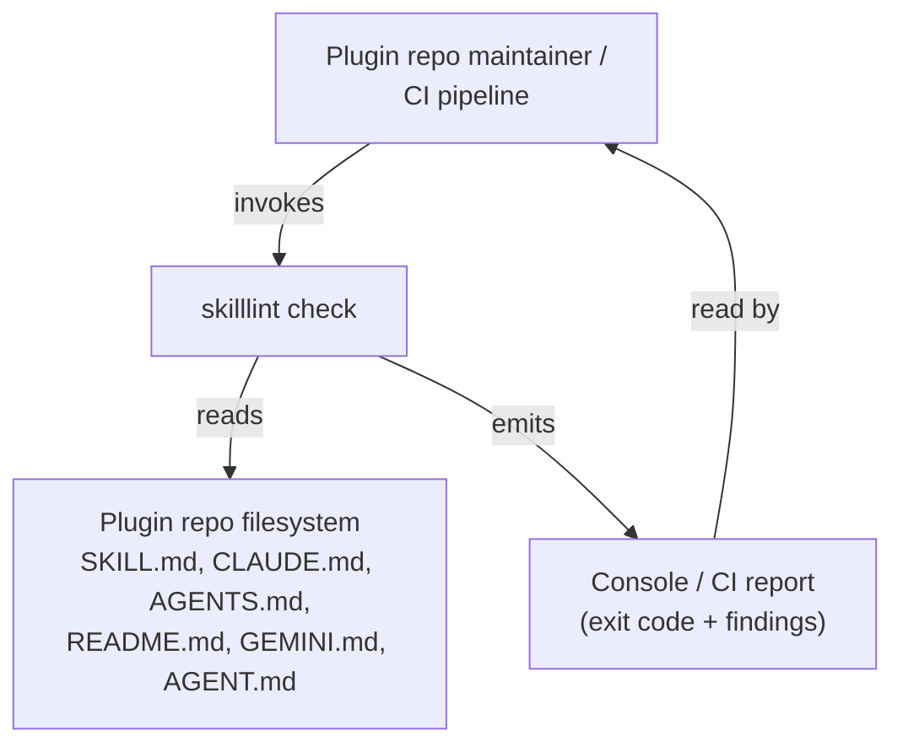
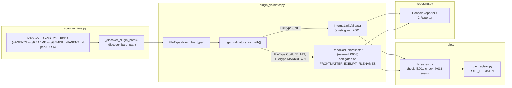

# Design: Markdown Link Conventions — Closing the Link-Validation Gap

Status: revised (post-adversarial-review)
Author: python-cli-design-spec (architecture pass)
Depends on: `packages/skilllint/rules/lk_series.py`, `packages/skilllint/plugin_validator.py`,
`packages/skilllint/scan_runtime.py`, `docs/maintainer-extension-guide.md`,
`docs/design-rule-provenance-registry.md`, `docs/TYPING_POLICY.md`

---

## 1. Executive Summary

skilllint scans four categories of markdown across a Claude Code plugin repo — `SKILL.md`,
repo/plugin-root convention docs (`CLAUDE.md`, `AGENTS.md`, `README.md`, `GEMINI.md`,
`AGENT.md`), skill-internal supporting content (`references/*.md`, `resources/**`,
`scripts/**`), and subagent/slash-command files (`agents/*.md`, `commands/*.md`) — but only
the first category gets link-existence checking (`LK001`). This design closes that gap for
the one category where the convention is well evidenced **and reachable**, and explicitly
defers the other two.

1. **Repo/plugin-root convention docs** (`CLAUDE.md`, `AGENTS.md`, `README.md`, `GEMINI.md`,
   `AGENT.md`) — add **`LK003`**, a broken-link existence check resolved against each file's
   own directory, gated to exactly these five filenames via the existing
   `FRONTMATTER_EXEMPT_FILENAMES` constant. To make it reachable, extend
   `DEFAULT_SCAN_PATTERNS` and `_discover_plugin_paths` to discover the four filenames that
   are missing today (`CLAUDE.md` is already discovered) — see ADR-6.
2. **Skill-internal supporting content** (`references/*.md` and friends) — **deferred**, same
   status as Category D. A `PD004` compromise (flag link presence without checking existence)
   was considered and dropped: it was unreachable by discovery for the same reason as
   `LK003` was, and even discovery aside, measured signal in this repo is 2 findings out of 66
   reference files, both in vendored third-party content, zero in this repo's own `plugins/`
   tree. See ADR-3.
3. **Subagent/slash-command files** (`agents/*.md`, `commands/*.md`) — **deferred**. No
   Claude Code documentation defines any link-following behavior for these files, and this is
   the one category auto-discovery *does* already reach — which makes shipping an unsourced
   rule here riskier, not safer, than deferring it. See ADR-4.

`LK002` stays retired (see `lk_series.py`'s module docstring) — this design does not reuse
that code.

---

## 2. Architecture Overview

### 2.1 C4 Context



### 2.2 C4 Container — link-validation path



---

## 3. Technology Stack

No new dependencies. This feature reuses this project's existing, already-in-repo
mechanisms rather than introducing anything new; each row cites the actual code it reuses
(not a general stack-selection policy document — no such document exists in this repo):

| Concern | Choice | Why (project-specific) |
|---|---|---|
| Rule registration | `@skilllint_rule` decorator (`rule_registry.py`) | Existing mechanism; every rule in the codebase registers this way, including `LK001` |
| Data model | `ValidationIssue` (Pydantic, `model_config = ConfigDict(frozen=True)`) | Existing model; `code` field already enforces `^[A-Z]{2}\d{3}$`, so `LK003` needs no schema change |
| Link extraction | `lk_series.py`'s existing `_iter_links` / `_strip_code_blocks` / `_should_ignore_link` | Root-agnostic already (pure text → tuples); no new parsing library needed |
| Discovery | `scan_runtime.py`'s existing `DEFAULT_SCAN_PATTERNS` glob mechanism | Extended, not replaced — see ADR-6 |
| Type checking | `ty` | Project standard; see §6 |
| Testing | `pytest` + `pytest-mock` + `hypothesis` | Matches `test_internal_link_validator.py`'s existing pattern |

---

## 4. Component Design

### 4.1 `packages/skilllint/rules/lk_series.py` — extend, do not replace

**Reused as-is** (no signature change): `LINK_PATTERN`, `CODE_FENCE_PATTERN`,
`INLINE_CODE_PATTERN`, `_strip_code_blocks`, `_should_ignore_link`, `_iter_links`. These
functions never took a resolution root — they operate on raw text and yield
`(link_text, link_url, link_url_no_fragment)` triples. Nothing about them assumed
`SKILL.md`; `check_lk001` was the only place that hardcoded `path.parent` as the resolution
root and attempted `${CLAUDE_*}` substitution. `check_lk003` reuses `path.parent` as its root
too (each file's own directory), so no root parameter needs to be threaded through the shared
helpers — only the existence-check loop itself is factored out (ADR-5 — do not generalize the
extraction helpers further).

**New — extracted from `check_lk001`'s body, used by both `check_lk001` and `check_lk003`:**

```python
def _resolve_link_target(link_url_no_fragment: str, base_dir: Path, *, substitute_claude_vars: bool) -> Path | None:
    """Resolve a relative link URL to an absolute Path, or None to skip the link.

    When substitute_claude_vars is True, applies the existing
    _resolve_claude_variables() substitution (SKILL.md only — see ADR-2).
    When False, any link containing a ${...} token is skipped outright:
    substitution semantics are undefined outside SKILL.md content per
    code.claude.com/docs/en/skills.md#available-string-substitutions, so
    skilllint has no basis for asserting the literal, unsubstituted path
    is broken.
    """
```

**New — LK003:**

```python
@skilllint_rule(
    "LK003",
    severity="error",
    category="link",
    platforms=["agentskills"],
    authority={"origin": "code.claude.com/docs/en/memory.md"},
)
def check_lk003(content: str, path: Path) -> list[ValidationIssue]:
    """## LK003 — Broken internal link in a repo/plugin-root convention doc

    A relative markdown link in CLAUDE.md, AGENTS.md, README.md, GEMINI.md, or
    AGENT.md points to a file that does not exist, resolved against the
    linking file's own directory (see ADR-2 for the evidence backing this
    root and its confidence level — the cited doc sentence covers Claude
    Code's `@import` mechanism, not plain markdown links, and this claim
    is extended to plain links by directional evidence, not a literal
    citation for this exact syntax).

    <!-- examples: LK003 -->
    """
```

`check_lk003` calls `_resolve_link_target(url, path.parent, substitute_claude_vars=False)`
for each `_iter_links(content)` triple and reports `LK003` when the resolved path is not
`None` and does not exist — structurally the same loop `check_lk001` already runs, sharing
`_resolve_link_target` rather than duplicating it. The `<!-- examples: LK003 -->` marker is
required — every existing rule docstring carries one, and `_render_examples_block`
(`plugin_validator.py`) expands it in `skilllint rule LK003` output.

### 4.2 `packages/skilllint/plugin_validator.py` — new validator class, filename gate, dispatch wiring

`RepoDocLinkValidator` follows the existing thin-wrapper pattern (`InternalLinkValidator`):
read the file, call the rule function, package results into a `ValidationResult`. Cannot
auto-fix (matches `InternalLinkValidator.can_fix()`, `False` today for the same class of
problem: fixing requires a human decision about content, not a mechanical rewrite).

**Filename gate.** Dispatching `RepoDocLinkValidator` for the entire `FileType.MARKDOWN` bucket
with no further narrowing was considered and rejected: `InternalLinkValidator.validate()`
already opens with exactly this kind of one-line filename guard
(`if path.name != "SKILL.md": return ValidationResult(passed=True, ...)`), and the exact
five-name target set already exists as a named constant, `FRONTMATTER_EXEMPT_FILENAMES`
(`plugin_validator.py:582-588`: `{"AGENT.md", "AGENTS.md", "GEMINI.md", "CLAUDE.md",
"README.md"}`). Ungated, the rule produces 9 findings across the `FileType.MARKDOWN` bucket on
this repo, 0 of them in a Category-B doc and 7 of 9 regex artifacts from Shiki-HTML vendor
captures under `.claude/vendor/sources/`. `RepoDocLinkValidator` therefore gates itself the
same way `InternalLinkValidator` does:

```python
class RepoDocLinkValidator:
    """Validates internal markdown links in repo/plugin-root convention docs (LK003).

    Gates on FRONTMATTER_EXEMPT_FILENAMES ({"AGENT.md", "AGENTS.md", "GEMINI.md",
    "CLAUDE.md", "README.md"}) -- the same five-name set that already exempts
    these filenames from the frontmatter requirement. Any other file reaching
    this validator (e.g. a Shiki-HTML vendor capture classified as
    FileType.MARKDOWN) is skipped, not scanned.
    """

    def validate(self, path: Path) -> ValidationResult: ...
    # if path.name not in FRONTMATTER_EXEMPT_FILENAMES:
    #     return ValidationResult(passed=True, errors=[], warnings=[], info=[])
    def can_fix(self) -> bool: ...  # False
    def fix(self, path: Path) -> list[str]: ...  # raises NotImplementedError
```

**Dispatch change in `_get_validators_for_path`** — the only existing function that decides
which validators run per file type. Current relevant branch:

```python
elif file_type in {FileType.CLAUDE_MD, FileType.REFERENCE, FileType.MARKDOWN}:
    validators.append(MarkdownTokenCounter())
```

New branch. `FileType.REFERENCE` is untouched (Category C is deferred — ADR-3); `CLAUDE_MD`
and `MARKDOWN` both gain `RepoDocLinkValidator()`, whose own internal filename gate (above) is
what actually narrows the five target files out of the whole bucket — the dispatch layer
itself stays as coarse-grained as it is today for every other validator in this codebase:

```python
elif file_type in {FileType.CLAUDE_MD, FileType.MARKDOWN}:
    validators.extend([MarkdownTokenCounter(), RepoDocLinkValidator()])
elif file_type == FileType.REFERENCE:
    validators.append(MarkdownTokenCounter())
```

`FileType.AGENT` and `FileType.COMMAND` (Category D) are untouched — they continue through
the `_NAME_BEARING_FILE_TYPES` branch exactly as today, receiving no link validator (ADR-4).

**Registry updates required** (`RepoDocLinkValidator`, `LINT` ownership, matching
`InternalLinkValidator`'s existing entry):

```python
VALIDATOR_OWNERSHIP: dict[str, ValidatorOwnership] = {
    # ... existing entries ...
    "RepoDocLinkValidator": ValidatorOwnership.LINT
}

VALIDATOR_CONSTRAINT_SCOPES: dict[str, set[str]] = {
    # ... existing entries ...
    "RepoDocLinkValidator": {"shared", "provider_specific"}
}
```

**`ErrorCode` StrEnum** (`plugin_validator.py:341-349`) gains a member, and the module-level
alias block (lines 423-424) is updated to export it — `test_docs_url_parity.py` parametrizes
over `list(ErrorCode)`, so omitting this silently drops `LK003` from that parity check:

```python
class ErrorCode(StrEnum):
    ...
    # Link (LK001, LK003)
    LK001 = "LK001"  # Broken internal link (file does not exist)
    LK003 = "LK003"  # Broken internal link in a repo/plugin-root convention doc
    ...


# Module-level aliases (replaces the existing single-value `LK001 = ErrorCode.LK001`):
LK001, LK003 = ErrorCode.LK001, ErrorCode.LK003
```

### 4.3 `packages/skilllint/scan_runtime.py` — discovery pattern extension (ADR-6)

Without this, `LK003` is unreachable by `skilllint check <directory>` — see ADR-6 for the
measured evidence. Two additions, both extending existing mechanisms with no new discovery
machinery:

```python
DEFAULT_SCAN_PATTERNS: tuple[str, ...] = (
    "**/skills/*/SKILL.md",
    "**/agents/*.md",
    "**/commands/*.md",
    "**/.claude-plugin/plugin.json",
    "**/hooks/hooks.json",
    "**/CLAUDE.md",
    "**/AGENTS.md",  # new
    "**/README.md",  # new
    "**/GEMINI.md",  # new
    "**/AGENT.md",  # new
)
```

`_discover_plugin_paths` gains four blocks alongside its existing `CLAUDE.md` block (same
exists-then-add pattern, so a plugin root without one of these files is unaffected):

```python
if (root / "CLAUDE.md").exists():
    discovered.add(root / "CLAUDE.md")
if (root / "AGENTS.md").exists():  # new
    discovered.add(root / "AGENTS.md")
if (root / "README.md").exists():  # new
    discovered.add(root / "README.md")
if (root / "GEMINI.md").exists():  # new
    discovered.add(root / "GEMINI.md")
if (root / "AGENT.md").exists():  # new
    discovered.add(root / "AGENT.md")
```

`_discover_provider_paths` and `_discover_bare_paths` need no direct change — the former
does not target repo/plugin-root docs at all (out of scope for provider-directory scans), and
the latter already iterates `DEFAULT_SCAN_PATTERNS` generically, so the four new glob entries
flow through it automatically.

**Side effect that must be measured, not assumed (§8 has the explicit verification step):**
every newly-discovered file also picks up whatever else `_get_validators_for_path` attaches
to `FileType.CLAUDE_MD`/`FileType.MARKDOWN` — today that is `MarkdownTokenCounter()`
(`TC001`, info-level) and the universal `SymlinkTargetValidator()`. This is a real, visible
change to `skilllint check`'s output on every repo that has an `AGENTS.md`/`README.md`, not
just a discovery-plumbing detail.

---

## 5. Data Architecture

No new persisted configuration and no schema changes. The single shared data model is the
existing `ValidationIssue` Pydantic model in `plugin_validator.py`:

```python
class ValidationIssue(BaseModel):
    model_config = ConfigDict(frozen=True)
    field: str
    severity: Literal["error", "warning", "info"]
    message: str
    code: Annotated[str, Field(pattern=r"^[A-Z]{2}\d{3}$")]
    line: int | None = None
    # ... existing fields unchanged
```

`LK003` satisfies `^[A-Z]{2}\d{3}$` — no `Field` constraint change needed. No new config
file, no new CLI flag: `LK003` runs automatically wherever `RepoDocLinkValidator` is
dispatched for a matching filename — i.e., wherever the file is discovered by
`scan_runtime.py`'s `DEFAULT_SCAN_PATTERNS` **as extended by ADR-6 (§10)**, or passed
explicitly as a path argument. Before ADR-6's discovery extension, that reach is limited to
`CLAUDE.md` plus whatever a caller hand-types; after it, `AGENTS.md`/`README.md`/`GEMINI.md`/
`AGENT.md` at every discovered plugin root are reached too.

---

## 6. Type System Design

### 6.1 Domain identifier inventory

No new domain identifier types are required. `FileType` (existing `StrEnum`) already
discriminates every file category this design touches (`CLAUDE_MD`, `MARKDOWN`, `AGENT`,
`COMMAND`, `REFERENCE`); rule codes already satisfy the existing regex-constrained `str`
field on `ValidationIssue.code`, and `ErrorCode` (existing `StrEnum`, §4.2) gains one member.
`LK003` is a new *value* of an existing, already-validated domain, not a new *type*.

### 6.2 Boundary validation map

The only I/O boundary this design touches is `path.read_text(encoding="utf-8")`, which
already exists (both `InternalLinkValidator.validate()` today and the new
`RepoDocLinkValidator.validate()` perform the same read, with the same `OSError` →
`FM002`-coded issue handling `InternalLinkValidator` already uses). No new external, network,
or subprocess data enters the system.

Per `docs/TYPING_POLICY.md` §4, a typed boundary is where *raw, external, or untrusted* input
enters. Markdown file content read from the local plugin repo under scan is the same trust
class `check_lk001` already processes today via plain `re.finditer` over `str` — it is not
schema-shaped external data (an API response, a config file with a defined shape), so it does
not require a `TypedDict`/Pydantic ingestion model. This mirrors the existing convention
across every file in `rules/`: link/text extraction stays on `str` and `tuple[str, str, str]`,
not modeled types, because the module is scanning free-text markdown, not deserializing a
structured payload. Introducing a Pydantic model here would be boundary machinery without a
boundary — the repo's own no-invented-constraints rule.

### 6.3 Type contracts

| Identifier | Definition | Creation | Validation | Consumption | Serialization |
|---|---|---|---|---|---|
| `rule_code` (`"LK003"`) | `Annotated[str, Field(pattern=r"^[A-Z]{2}\d{3}$")]` on `ValidationIssue.code` (existing); `ErrorCode.LK003` member (§4.2) | Literal string argument to `_make_issue(code=...)` inside `check_lk003` | Pydantic pattern constraint at `ValidationIssue` construction (existing, unchanged) | `reporting.py` reporters, `rule` / `rules` CLI commands, `test_docs_url_parity.py` (parametrizes `list(ErrorCode)`), `assert_rules_completeness.py` (series-prefix count only) | `ValidationIssue.model_dump()` → JSON in `CIReporter`; unchanged |
| `resolved_link_target` (`Path \| None`) | Return type of new `_resolve_link_target()` | Inside `_resolve_link_target`, from `(base_dir / url).resolve()` | `None` sentinel means "skip — no basis to assert broken" (existing pattern from `_resolve_claude_variables`, reused as a sentinel convention, not reused as code) | `check_lk001` and `check_lk003` existence-check loops only | N/A — never serialized, resolved within a single rule-function call |

### 6.4 Weak type audit

No `Any`, `object`, or `cast()` introduced anywhere in this design. `_resolve_link_target`
returns `Path | None` (a real union, not `Any`); callers must handle both branches explicitly
before dereferencing. `ty check packages/` is the sole type checker per this project's policy
(mypy/basedpyright intentionally off) — this design introduces nothing that requires either.

---

## 7. Security Architecture

- **No new external I/O.** `RepoDocLinkValidator` reads only files already inside the scanned
  plugin repo tree, using the same `path.read_text(encoding="utf-8")` call
  `InternalLinkValidator` uses today.
- **No new subprocess, network, or credential surface.** Nothing in this design touches
  `subprocess`, environment variables, or secret storage.
- **Path resolution is existence-checking, not file access control.** `_resolve_link_target`
  calls `.resolve()` then `.exists()`, exactly as `check_lk001` does today — this can walk
  outside the plugin tree via `../` segments and report on files it finds there, but it never
  reads, executes, or writes the target; it only reports true/false existence. This is the
  same trust model `LK001` has operated under since its introduction, and is not a new
  security surface. (The pre-existing `../`-walk ambiguity for `SKILL.md` links is explicitly
  out of scope per §12 — this design neither fixes nor worsens it.)
- **Security checklist** (standard categories for a file-existence-checking feature):
  path traversal — no
  mitigation needed beyond existing `LK001` behavior (read-only existence check, not a file
  access boundary); command injection — N/A, no subprocess calls added; secure temp files —
  N/A; rate limiting — N/A, no API calls; certificate validation — N/A, no HTTPS calls.

---

## 8. Testing Architecture

### 8.1 Test files

```text
packages/skilllint/tests/
├── test_repo_doc_link_validator.py       # LK003 — filter: -k lk003 or -k repo_doc_link
└── test_scan_runtime.py                  # extended: discovery-reachability assertions (ADR-6)
```

`test_repo_doc_link_validator.py` follows `test_internal_link_validator.py`'s existing
structure (that file collects **29** tests, verified via `pytest --collect-only`):
broken-link detection, valid-link pass-through,
external/anchor/absolute-link filtering (shared helper — verify the reused filter still
applies, not re-derive it), the `${...}`-token skip behavior (`LK003` skips unconditionally
per ADR-2; `check_lk001`'s existing substitution tests are untouched), and the filename-gate
behavior (§4.2) — a non-`FRONTMATTER_EXEMPT_FILENAMES` file with a genuinely broken link must
produce zero findings.

### 8.2 Required tests, written first (TDD — REQUIRED)

`test_internal_link_validator.py` imports the exact module this design changes
(`skilllint.rules.lk_series`), and the project is a CLI application — both independently
select TDD as required per this project's standard determination. Two tests are required;
write everything below **before** implementation, confirm it is RED against the current
codebase, then implement to GREEN:

1. **Discovery-reachability test — bare AND plugin context.** ADR-6 has two independent
   halves: the `DEFAULT_SCAN_PATTERNS` glob additions (reached via `_discover_bare_paths`)
   and the `_discover_plugin_paths` exists-then-add blocks. A bare-context `tmp_path` alone
   only exercises the first half — verified: with only the `DEFAULT_SCAN_PATTERNS` half
   applied, a bare `tmp_path` finds all five target filenames (test would go GREEN), while a
   *plugin*-context `tmp_path` (one containing `.claude-plugin/plugin.json`) still finds
   **zero** of them, because `_discover_bare_paths` filters out any glob match under a
   `covered_root`. An implementer could ship only that half, pass a bare-only test, and leave
   every plugin-root `README.md`/`AGENTS.md` unreachable. This is the one required test that
   actually guards a real defect; the two sub-cases are both mandatory:
   - **Bare case**: build a `tmp_path` directory (no `.claude-plugin/plugin.json`) containing
     `AGENTS.md`, `README.md`, `GEMINI.md`, `AGENT.md`, `CLAUDE.md`; assert
     `_discover_validatable_paths(tmp_path)` returns all five.
   - **Plugin case**: build a `tmp_path` directory containing `.claude-plugin/plugin.json`
     plus the same five filenames at its root; assert `_discover_validatable_paths(tmp_path)`
     returns all five. This case is RED under the `DEFAULT_SCAN_PATTERNS` half alone and
     GREEN only once `_discover_plugin_paths` is also extended — it is the only test that
     pins that half of ADR-6.
   **Both cases fail against the current codebase today** — write them first.
2. **Vendor-doc false-positive guard**: feed `RepoDocLinkValidator` a file named
   `some-doc.md` (i.e. *not* in `FRONTMATTER_EXEMPT_FILENAMES`) whose body is a real Shiki-HTML
   `<span>` snippet copied from `.claude/vendor/sources/claude-code--skills-*.md`
   (`LINK_PATTERN` matches bracket/paren sequences inside that markup); assert **zero**
   issues. This is the regression guard for §4.2's filename gate.

`@given`/Hypothesis on `_resolve_link_target` (below) is a reasonable addition but does not
substitute for either of these two — neither defect was a property-testable invariant, both
were reachability/gating decisions.

### 8.3 Fixtures

Located under the existing `_FIXTURES_ROOT` convention
(`packages/skilllint/tests/fixtures/providers/agentskills/{failing,passing}-examples/`), not
a new top-level directory — a separate `tests/fixtures/link_conventions/` directory would sit
outside that root and leave `skilllint rule LK003` printing "No fixture examples available
yet":

```text
packages/skilllint/tests/fixtures/providers/agentskills/
├── failing-examples/LK003/
│   ├── AGENTS.md          # [Guide](docs/missing.md)  -> does not exist
│   ├── README.md          # [Ref](./nope/thing.md)    -> does not exist
│   └── CLAUDE.md          # [Notes](sub/gone.md)      -> does not exist
└── passing-examples/LK003/
    ├── AGENTS.md          # [Guide](docs/real.md)     -> exists
    ├── docs/real.md
    ├── README.md          # [Ref](./sub/there.md), [Ext](https://x.test), [A](#anchor)
    ├── sub/there.md
    ├── CLAUDE.md          # @AGENTS.md  (import syntax — must NOT be flagged)
    └── not-a-convention-doc.md  # [X](totally-missing.md) — must NOT be flagged (filename gate)
```

`LK001`/`PD001` ship with no committed example fixtures either, so omitting them would also be
within precedent — this design adds them anyway because the filename-gate and `@import`
non-flagging behaviors are exactly the two properties that are hard to verify by reasoning
about the code alone and benefit from a concrete, runnable example.

### 8.4 Property-based testing (Hypothesis)

`_resolve_link_target` is the shared logic `check_lk001` and `check_lk003` both exercise;
property-test it directly:

- **Invariant**: for any generated relative path string without a `${...}` token, the
  function's `Path | None` result agrees with a direct `(base_dir / url).resolve().exists()`
  check on the same generated filesystem fixture.
- **Invariant**: for any generated URL containing a `${...}`-shaped token
  (`CLAUDE_VAR_PATTERN`), `_resolve_link_target(..., substitute_claude_vars=False)` always
  returns `None` regardless of whether a file happens to exist at the literal unsubstituted
  path.

`@given` with `hypothesis.strategies`, `@settings(deadline=None)` — matching this
repo's actual Hypothesis usage. No file in `packages/skilllint/tests/` sets a custom
`max_examples`; the existing `@given` tests (`test_token_counting.py`) use
`@settings(deadline=None)` and Hypothesis's own default example count. This design follows
that precedent rather than inventing a number.

### 8.5 Coverage target

80% line and branch coverage for this feature's new code, as a design-level bar (this is not
payment/auth/security-critical code, so the 95%+/mutation-testing tier does not apply). Note:
the project-wide `[tool.coverage.report] fail_under` gate in `pyproject.toml` is **60**
(`pyproject.toml:129`), not 80 — this feature's 80% target is a self-imposed bar for its own
new code, not something the repo-wide gate enforces. No `pyproject.toml` change is required.

### 8.6 Pre-ship verification (ADR-6 side effect — explicit step, not a footnote)

Extending `DEFAULT_SCAN_PATTERNS` (ADR-6) widens the scan set on every repo with an
`AGENTS.md`/`README.md`/`GEMINI.md`/`AGENT.md`, not just this one — see ADR-6 for the measured
72→77-path, 6-file reachability delta this step verifies against.

Before this change is merged:

1. Run `uv run skilllint check .` before and after the change on this repo and on
   `tests/fixtures/benchmark-plugin-1000-skills.zip` / `benchmark-plugin-violations.zip`;
   diff the output against ADR-6's expected delta (5 newly-discovered files, each contributing
   one `TC001` info line from `MarkdownTokenCounter()`). **Do not gate this on exit code** —
   `uv run skilllint check .` on this repo already fails today (`Total files: 71, Passed: 62,
   Failed: 9, Warnings: 16`, unrelated to this change), so the exit code is already non-zero
   and "unchanged" would be trivially true regardless of whether `LK003` works correctly.
   Compare **finding counts** instead: `LK003` findings must be 0 on this repo's current
   content, and the total failed-file count must not increase beyond what is attributable to
   genuinely new, correct findings.
2. Re-run `scripts/bench_io.py` before and after on the benchmark fixtures and compare
   wall-clock time — `**/README.md`/`**/AGENTS.md` glob the whole tree, so this is a real
   discovery-cost change, not a no-op. Use this repo's own configured regression tolerance:
   `.github/workflows/benchmark.yml` sets `alert-threshold: '130%'` (i.e. a 30% regression is
   this repo's existing bar for "needs an explanation") — reuse it here.

---

## 9. Distribution Architecture

No change. skilllint is distributed as a Python package (`packages/skilllint/`), not a
standalone PEP 723 script — this feature adds one function to an existing module
(`lk_series.py`), one class to `plugin_validator.py`, and extends two existing constants in
`scan_runtime.py`. No new file needs a shebang or PEP 723 metadata block.

---

## 10. Architectural Decisions (ADRs)

### ADR-1: Fresh rule code — `LK003`; `LK002` stays retired

**Decision:** The Category B existence-checker uses `LK003` (next unused code in the LK
series).

**Rationale:** `LK002` was deleted because it asserted a `./`-prefix requirement with no
sourced justification and fired on both the AgentSkills spec's own worked example and
Anthropic's skills doc example (`lk_series.py` module docstring). Reusing `LK002` for an
unrelated rule would erase that history and risk a maintainer assuming the retired rule was
reinstated. `LK003` is confirmed free by inspection of `RULE_REGISTRY` (`lk_series.py`
registers `LK001` only).

### ADR-2: Category B — file's-own-directory root, plain links only, no `${CLAUDE_*}` substitution

**Decision:** `LK003` resolves each link against `path.parent` (the linking file's own
directory). It processes only plain `[text](url)` markdown links. It does not evaluate
Claude Code's `@path/to/import` memory-import syntax. It does not attempt `${CLAUDE_*}`
substitution — any link containing a `${...}` token is skipped, not flagged.

**Rationale:**

- **Root.** Claude Code's memory-import documentation
  (`code.claude.com/docs/en/memory.md`, "Import additional files") states explicitly that
  relative import paths "resolve relative to the file containing the import, not the working
  directory." That sentence is written for the `@import` mechanism, not plain markdown links,
  so it is not a literal citation for this rule — but this repo's own two working examples
  (`README.md:508` → `docs/ignore-config.md`, resolved against the repo-root README's own
  directory; `plugins/agentskills-skilllint/README.md:68` → `./skills/skilllint/references/
  rule-catalog.md`, resolved against *that* README's own directory, not the repo root) both
  independently confirm file's-own-directory resolution for plain links too. Confidence: high,
  by directional evidence plus internal repo consistency, not by a single documented sentence
  that covers the exact syntax being checked. This caveat is recorded in the rule's own
  docstring (§4.1) — per ADR-1/§11, `LK003` gets **no** provenance-registry entry (matching
  `LK001`'s existing convention), so the docstring is where a human reads this distinction,
  not a machine-checked claim record.
- **Plain links only, not `@import`.** `@import` is a materially different feature: it
  supports absolute (`~/`-prefixed) paths, has a max recursion depth of 4, and gates imports
  that resolve outside the working directory behind a one-time approval dialog. None of those
  exception rules apply to a plain `[text](url)` link, which Claude Code does not parse or
  dereference at all — it exists for human/GitHub readers only. Building one checker that
  conflated both syntaxes would silently apply the wrong exception rules to one of them.
  `@import` existence-checking is explicitly out of scope (§12) and left as a candidate for a
  future, separate rule.
- **No `${CLAUDE_*}` substitution.** The substitution variables are documented to apply in
  exactly two places: "the skill's markdown content, and Bash rules in the `allowed-tools`
  frontmatter" (`code.claude.com/docs/en/skills.md#available-string-substitutions`) — i.e.
  `SKILL.md` only. Applying `_resolve_claude_variables` to `CLAUDE.md`/`AGENTS.md`/etc. would
  assert a substitution behavior the documentation does not claim exists for those files.
  Skipping (rather than flagging as broken) any link containing a `${...}` token is the
  conservative choice: a literal, unsubstituted `${...}` path is unlikely to exist on disk,
  and flagging it would produce a near-certain false positive on any convention doc that uses
  `${...}` syntax for illustrative purposes.

**Confidence:** High for the root; explicitly not claimed as a literal documented rule for
plain-link syntax specifically.

### ADR-3: Category C — deferred (revised: reachability and measured signal, not "no evidence for a root")

**Decision:** Do not add any link rule — existence-checker or presence-flagger — for links
inside `references/*.md`, `resources/**`, or `scripts/**` in this iteration. No `PD004` or
equivalent rule ships.

**Root-uncertainty is not the blocker.** A `references/*.md` file is rendered by GitHub under
the identical CommonMark relative-path semantics as a `README.md` — the *only* thing that
changes between the two categories is the filename, not the applicable resolution convention.
The same file's-own-directory reasoning that backs `LK003` (ADR-2) applies here too, so root
ambiguity is not why this category is deferred.

**Why this is deferred, on the actual grounds:**

1. **Reachability.** No discovery pattern in `scan_runtime.py` reaches `references/*.md`
   today, and this design's `DEFAULT_SCAN_PATTERNS` change (ADR-6) does not add one — adding
   it would mean scanning every skill's reference material by default, a materially larger
   and unvalidated blast-radius change this iteration does not take on.
2. **Weak measured signal even if reachability were fixed.** Of 66 `FileType.REFERENCE`
   files in this repo, 2 contain any relative markdown link at all, and both are in vendored
   third-party content under `.claude/`, not this repo's own `plugins/` tree.
3. **The AgentSkills specification's own guidance** ("Keep file references one level deep
   from SKILL.md. Avoid deeply nested reference chains.") argues that reference files
   generally should not contain further links in the first place — which weakens the case for
   building an existence-checker for a pattern the spec itself discourages, independent of the
   reachability and signal points above.

No example of a `references/*.md` file containing a broken link exists anywhere in this repo
to validate against either way.

**Confidence:** The resolution-root question is no longer the blocking factor (see above) —
reachability and measured signal are. Revisit if `references/*.md` discovery is added for
other reasons and real broken-link signal is observed in practice.

### ADR-4: Category D — deferred, no rule added

**Decision:** No link validation of any kind is added for `agents/*.md` or `commands/*.md` in
this iteration.

**Rationale:** No Claude Code documentation defines any link convention for subagent or
slash-command files. The official commands documentation explicitly states skills are
recommended over commands specifically *because* skills "support additional features like
supporting files" — i.e., commands do not get `SKILL.md`'s link-dereferencing feature at all.
A subagent file's body "becomes the system prompt"; nothing in the documentation mentions
markdown-link parsing for it. Measured: **1** of 110 agent/command files in this repo contains
a markdown link — not enough to establish a usage pattern to validate against. The conclusion
is unchanged: a
broken link here is, at most, a human-readability defect — it does not break any documented
runtime feature, unlike a broken `SKILL.md` link which breaks the documented "supporting
files" mechanism. Per the ladder in this project's own engineering discipline ("does this need
to exist at all?" before "how would we build it?"), the answer for this category this
iteration is no. `NamespaceReferenceValidator` (`NR001`/`NR002`) already validates a distinct,
unrelated reference syntax (`@plugin:agent-name`, `/plugin:skill-name`, `Skill()`, `Task()`)
in these same files — nothing here conflicts with or duplicates that.

**Note the inverted risk profile:** `agents/*.md` and `commands/*.md` are, in fact, the *one*
category in this whole design that auto-discovery already reliably reaches
(`DEFAULT_SCAN_PATTERNS` includes `**/agents/*.md` and `**/commands/*.md` today). A rule here
would actually fire on real scans. That makes deferring Category D *more* conservative than it
looks, not less — an
unsourced rule here would be immediately live, not inert.

**Revisit when:** either Claude Code documents link-following behavior for these files, or
real-world plugin repos accumulate markdown links in `agents/*.md`/`commands/*.md` that
maintainers want checked.

### ADR-5: `lk_series.py` helpers reused as-is; only the existence-check loop is factored out

**Decision:** `_iter_links`, `_strip_code_blocks`, `_should_ignore_link` are reused
unmodified — no resolution-root parameter is added to them, because none of them ever took
one. The only new shared code is `_resolve_link_target`, extracted from `check_lk001`'s
existence-check loop, parameterized by `base_dir: Path` and
`substitute_claude_vars: bool`.

**Rationale:** Both `check_lk001` (root = `SKILL.md`'s parent, substitution on) and
`check_lk003` (root = the convention doc's own parent, substitution off) always pass
`path.parent` as the root — every relevant file type in this design resolves against its own
directory. There is no case in this design where the root differs from `path.parent`, so
threading a caller-supplied root through the text-extraction helpers would be unused
generality. The one real behavioral difference between the two rules — whether `${CLAUDE_*}`
substitution is attempted — is exactly what `substitute_claude_vars` isolates. Do not
generalize further.

### ADR-6: Extend `DEFAULT_SCAN_PATTERNS` and `_discover_plugin_paths` so `LK003` is reachable

**Decision:** Add `**/AGENTS.md`, `**/README.md`, `**/GEMINI.md`, `**/AGENT.md` to
`DEFAULT_SCAN_PATTERNS`, and add matching `if (root / "<name>").exists(): discovered.add(...)`
blocks to `_discover_plugin_paths`, next to the existing `CLAUDE.md` block (§4.3).

**Rationale.** Without this, `LK003` cannot fire under `skilllint check <directory>` at all
for four of its five target filenames. Measured on this repo:
`_discover_validatable_paths(repo_root)` returns 72 paths, of which `CLAUDE.md` accounts for
1 and `AGENTS.md`/`README.md`/`GEMINI.md`/`AGENT.md` account for 0 combined. The one file
`LK003` *could* reach without this change (`CLAUDE.md`) contains only `@AGENTS.md`, which
ADR-2 explicitly places out of scope — so without ADR-6, `LK003` would ship correct and
reachable-by-hand-typed-path, but produce zero findings under the normal `skilllint check .`
workflow this feature exists to serve.

**This is a genuine behavior change with its own blast radius**, not a plumbing detail: every
newly-discovered file also picks up whatever `_get_validators_for_path` already attaches to
`FileType.CLAUDE_MD`/`FileType.MARKDOWN` — currently `MarkdownTokenCounter()` (`TC001`,
info-level) and the universal `SymlinkTargetValidator()`. Applying both halves of this ADR:
discovery grows from 72 to **77** paths (**+5**). The fifth addition is not a Category-B doc —
`**/AGENTS.md` also newly discovers
`packages/skilllint/tests/fixtures/codex/{empty,valid}/AGENTS.md`, skilllint's own
negative-test fixtures for `CX001` (one is a 1-byte file, deliberately invalid) — so the actual
`LK003`-reachable gate-name set on this repo is **6 files, not 4**: `CLAUDE.md`, `AGENTS.md`,
`README.md`, `plugins/agentskills-skilllint/README.md`, and the two
`.../codex/{empty,valid}/AGENTS.md` fixtures. Harmless (neither fixture has a broken link;
both currently produce only `TC001` info) but real — §8.6's pre-merge verification step checks
against this actual 6-file, +5-path delta, not an assumed +4.

**Alternative considered and rejected:** widen `InternalLinkValidator`'s existing
`SKILL.md`-only guard to also accept the five convention filenames, dispatching it (instead of
a new `RepoDocLinkValidator`) for `CLAUDE_MD`/`MARKDOWN`, and gate `${CLAUDE_*}` substitution
on `path.name == "SKILL.md"`. This is a smaller diff (no new rule code, no `ErrorCode`/catalog
churn) but conflates two distinct claims under one rule code: `LK001`'s docstring, catalog
entry, and fix note all say "in `SKILL.md`" today, and any existing ignore-config suppressing
`LK001` would silently start suppressing convention-doc findings too. Rejected in favor of
`LK003` as a separate code, preserving "one code, one claim."

---

## 11. Documentation & Registration Checklist

Every file that must change for this design to ship, and the exact edit required:

- **`plugins/agentskills-skilllint/skills/skilllint/references/rule-catalog.md`**
  - Add a row to the `## LK — Internal Link Rules` table:
    `| LK003 | error | no | Broken internal link in a repo/plugin-root convention doc (CLAUDE.md, AGENTS.md, README.md, GEMINI.md, AGENT.md) |`
  - Add a fix note below the table, matching the existing `LK001 fix:` note style:
    `**LK003 fix:** Links in these files are relative to that file's own directory, not the repo root. Verify the linked file path is correct relative to where the link is written.`
  - No `PD` table change — `PD004` is dropped (ADR-3).
- **`README.md`** (repo root) — update the `## What gets validated` table: change the
  `LK001` row's code column to `LK001, LK003` and description to add "; LK003 covers
  CLAUDE.md/AGENTS.md/README.md/GEMINI.md/AGENT.md, resolved against each file's own
  directory."
- **`plugins/agentskills-skilllint/README.md`** (a *second*, separate rule-series table at
  line 76, distinct from the root `README.md` table above — both need the edit): change the
  `| LK001 | Internal markdown links |` row to
  `| LK001, LK003 | Internal markdown links (LK003: repo/plugin-root convention docs) |`.
- **`packages/skilllint/schemas/provenance-registry.json`** — **no entry.** The registry's
  three existing claims all have `claim_type` in `{enum_set, scalar, pattern, field_set}`
  with a resolvable `assertion_location.symbol` that `test_provenance_registry_locators.py`
  imports and checks. `LK003`'s claim (a resolution-root *behavior*, `path.parent`) is none of
  those types and has no named constant to point at — inventing one purely to satisfy the
  registry schema would itself be an invented constraint. `LK001` and `PD001`–`PD003` already
  follow the correct convention: no registry entry, citation lives only in
  `@skilllint_rule(authority={...})`. `LK003` does the same. The ADR-2 caveat about the
  `memory.md` citation covering `@import` rather than plain links lives in the rule's own
  docstring (§4.1), where a human reads it.
- **`packages/skilllint/schemas/opinion-catalog.json`** — no entry; `LK003` is backed by a
  citation (however caveated), not an un-backed opinion.
- **`ErrorCode` StrEnum + module-level alias** (`plugin_validator.py:341-349`, `423-424`) —
  add `LK003 = "LK003"` and update the alias line to `LK001, LK003 = ErrorCode.LK001,
  ErrorCode.LK003`, per §4.2. Required so `test_docs_url_parity.py`'s
  `@pytest.mark.parametrize("code", list(ErrorCode))` covers the new code.
- **`packages/skilllint/rules/_constants.py`** — **no change.** `EXPECTED_SERIES` already
  contains `LK`; `MIN_REGISTERED_SERIES` is a series-prefix count, not a per-rule count.
- **`scripts/assert_rules_completeness.py`** — **no change.** It parses `skilllint rules`
  output for two-letter series prefixes only (`re.findall(r"\b([A-Z]{2})\d{3}\b", ...)`); it
  has no per-rule-code assertion to update.
- **`packages/skilllint/scan_runtime.py`** — `DEFAULT_SCAN_PATTERNS` and
  `_discover_plugin_paths` edits per ADR-6/§4.3.
- **`skilllint docs fetch-authorities`** — adding `code.claude.com/docs/en/memory.md` as a
  new `authority.origin` widens the URL set that command fetches. Expected and harmless; no
  action needed beyond awareness.
- **Registration mechanics** (`docs/maintainer-extension-guide.md` §3):
  - `@skilllint_rule("LK003", severity="error", category="link", platforms=["agentskills"], authority={"origin": "code.claude.com/docs/en/memory.md"})` on `check_lk003` in `lk_series.py`, with the `<!-- examples: LK003 -->` docstring marker (§4.1).
  - Add `RepoDocLinkValidator` to `_get_validators_for_path` per §4.2, with its own
    `FRONTMATTER_EXEMPT_FILENAMES` gate inside `validate()`.
  - Add `RepoDocLinkValidator` to `VALIDATOR_OWNERSHIP` (`LINT`) and
    `VALIDATOR_CONSTRAINT_SCOPES` (`{"shared", "provider_specific"}`) in `plugin_validator.py`.

---

## 12. Explicit Scope

### In scope

- `LK003`: broken-link existence check for the five filenames in
  `FRONTMATTER_EXEMPT_FILENAMES` (`CLAUDE.md`, `AGENTS.md`, `README.md`, `GEMINI.md`,
  `AGENT.md`), resolved against each linking file's own directory, plain `[text](url)` links
  only, gated at the validator layer (§4.2) — not a bucket-wide `FileType.MARKDOWN` rule.
  **Coverage is conditional on `FileType.detect_file_type`'s classification, not the filename
  alone.** `detect_file_type` checks `"agents" in path.parts`, `"commands" in path.parts`,
  `"hooks" in path.parts`, and `"references" in path.parts and path.suffix == ".md"` *before*
  it ever reaches the plain-`.md`/`CLAUDE_MD` branch — so a gate-name file living under one of
  those path segments (e.g. `agents/README.md`, `some/references/AGENTS.md`) classifies as
  `FileType.AGENT`/`FileType.REFERENCE`, not `FileType.CLAUDE_MD`/`FileType.MARKDOWN`, and
  `RepoDocLinkValidator` — dispatched only for the latter two — never sees it. No such file
  exists in this repo today (verified); this is a known, currently-latent limitation, not a
  claim of universal coverage, and this design does not fix it.
- Discovery pattern extension (ADR-6) so `LK003` actually fires under `skilllint check
  <directory>`, with the pre-merge verification step in §8.6.
- New test files, fixtures, and registration edits listed in §8 and §11.

### Out of scope (deferred, not silently assumed)

- **`@path/to/import` token checking** in `CLAUDE.md`/`CLAUDE.local.md` — a distinct syntax
  from plain markdown links, with its own exception rules (approval dialog, max recursion
  depth 4, `~/`-prefixed absolute paths). Candidate for a future, separate rule.
- **`SKILL.md`'s own upward-directory-walk ambiguity** (`../other-skill/x.md`) — pre-existing
  in `LK001`, not addressed or worsened by this design.
- **Category C — any link validation for `references/*.md`, `resources/**`, `scripts/**`**
  (ADR-3, revised) — fully deferred, same status as Category D. No `PD004` or equivalent ships
  in this iteration.
- **`${CLAUDE_*}` substitution outside `SKILL.md`** — undocumented either way for any file
  category this design touches; not attempted anywhere `LK003` runs (`SKILL.md`'s existing
  `LK001` behavior is unchanged).
- **Any link validation for `agents/*.md` or `commands/*.md`** (ADR-4) — fully deferred, even
  though this is the one category auto-discovery already reaches.
- **`GEMINI.md`/`AGENT.md`-specific verification against Gemini-CLI-specific documentation**
  — these two filenames are covered by `LK003` only by virtue of membership in
  `FRONTMATTER_EXEMPT_FILENAMES` alongside `AGENTS.md`/`README.md`; no Gemini-CLI-specific
  doc was consulted to confirm the convention independently for those two filenames.

---

## 13. Scalability Strategy

`LK003` itself runs synchronously within the existing per-file validation loop in
`scan_runtime.py`, at the same point `InternalLinkValidator` already runs — O(files × links
per file) regex scanning, identical complexity class to the existing `LK001`. That part is
unchanged from before and remains low-risk.

This design deliberately widens the scan set (ADR-6): `**/AGENTS.md`, `**/README.md`,
`**/GEMINI.md`, `**/AGENT.md` join `DEFAULT_SCAN_PATTERNS`. The expected growth is bounded — at
most one file per plugin root or
provider root per new filename, not proportional to skill or agent count — but `**/README.md`
in particular globs the entire directory tree on every scan, which is a real discovery-cost
change on large repos, not a bounded one. §8.6 requires a `scripts/bench_io.py` before/after
comparison before this ships specifically because the cost is not assumed to be negligible;
it must be measured.
